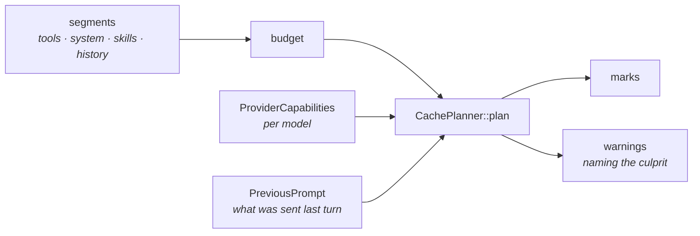

# Context and caching

The part of Frey that is actually novel: the prompt is a planned artefact, not a string you
concatenate.

## The problem

Prompt caching is the largest cost lever in agent work and the easiest to lose silently. **No
provider reports a cache miss.** A prompt that cached yesterday and does not today produces no
error, no warning, and no log line — just a larger bill, discovered a month later if at all.

Three ways to lose it, all of which Frey detects:

**Churn.** A clock, a session id, or a token count interpolated into the system prompt rewrites the
cached prefix every turn.

```
== the same prompt, with a clock in it ==
  cached prefix: 12000 tokens
  churn in `system`: 800 tokens rewritten every turn
```

**Being under the minimum.** Anthropic's minimum cacheable prefix is **512 on Opus 5 and 4096 on
Haiku 4.5** — an eightfold difference between two models from one vendor. A prompt that caches on
one silently does not cache at all on the other.

**Exceeding the lookback.** Anthropic search only **20 content blocks backward** from a breakpoint.
A single agentic turn with several tool calls can exceed that, so the *next* request misses cache
entirely. This one was found by an adversarial re-check of the project's own novelty claim, having
been in the research notes and never implemented.

## How it works



`CachePlanner::plan` is a **pure function** of segments, the previous prompt, and the model's
capabilities. That is what makes every rule above testable without a network, a key, or a bill —
and property tests over it found two real bugs that examples had not.

```rust
let plan = CachePlanner::plan(&segments, &previous, &caps);
println!("{} tokens cached", plan.cached_prefix_tokens);
for warning in &plan.warnings {
    println!("{warning:?}");
}
```

Try it:

```bash
cargo run -p frey --example cache_planning
```

## Rules the planner enforces

- **A breakpoint is never placed on a segment that changed last turn.** Marking volatile content is
  worse than not caching: you pay the write and get no read.
- **Lifetimes are assigned positionally, not by segment kind.** Nothing orders segments by kind, and
  a short-lived mark before a long-lived one is a 400 from Anthropic.
- **"No marks" is disambiguated.** The provider caching automatically and nothing being cacheable
  are different answers to the same question, and `provider_caches_automatically` says which.

## Warnings

`run.warnings` is how the framework tells you it is doing something less useful than you asked.
Distinct warnings are reported **once**, not every turn — a warning repeated every turn is noise
that trains people to ignore warnings.

| Warning | Means |
|---|---|
| `CacheChurn` | A stable segment changed. Names the segment and the tokens rewritten. |
| `BelowMinPrefix` | The prefix is shorter than this model's minimum. Caching is doing nothing. |
| `LookbackExceeded` | This turn added more blocks than the provider searches back through. |
| `BudgetPressure` | The window is nearly full and eviction has begun. |
| `ToolCallsCapped` | One response asked for more tool calls than the run permits. |
| `RouteChanged` | The router served this call from a different upstream — different tokenizer, price, and cache. |
| `Degraded` | A capability was wanted and is not there. |

## Ordering is not negotiable

Segments are ordered by how likely they are to change: tools, then system, then skills, then
history. A change at any level invalidates that level and everything after it, so any other order
would make a stable thing sit behind a volatile one and cache nothing.

This is also why the tool registry uses a `BTreeMap` rather than a `HashMap`. The tool block is the
stable prefix, so iteration order must not depend on insertion order or a per-process hash seed.

## Budgets

```rust
let budget = ContextBudget::from_capabilities(&caps);
```

When the window fills, eviction happens and **says so**. Truncation reports the withheld byte count
and tells the model how to get the rest — silent truncation is the bug that field exists to prevent.

Token counting is deliberately crude and documented as such: it is used for budgeting and the
minimum-prefix check, both of which need an order of magnitude rather than a tokenizer. A real
tokenizer would be per-model, would have to be shipped or downloaded, and would make the crate
impure.

## Tools, skills, and code-mode are one catalog

Three presentations of the same progressively-disclosed set, which is why they share a selector, a
budget, and a search index:

- **Deferred tools** — the definition is withheld until searched for. Note that Anthropic's
  `defer_loading` saves *context*, not bandwidth; every definition is still sent on every request.
- **Skills** — an index rung stays small next to a body of the size the format recommends. Twenty
  skills do not cost twenty bodies at startup.
- **Code mode** — a typed API surface instead of a tool block. The surface is generated even when
  code mode is off, because it doubles as the corpus tool search indexes.

## Prior art

Frey is not the first thing to notice prompt caches break.
[`make-agents-cheaper`](https://github.com/Just-Agent/make-agents-cheaper) and
[LeanCTX](https://github.com/yvgude/lean-ctx) both attack this in Rust; both sit *beside* an agent.
The narrower and defensible claim is that Frey is the first Rust framework where the cache plan is a
core type recomputed every turn from provider capabilities, and where the loop refuses a breakpoint
the plan says is worthless.
