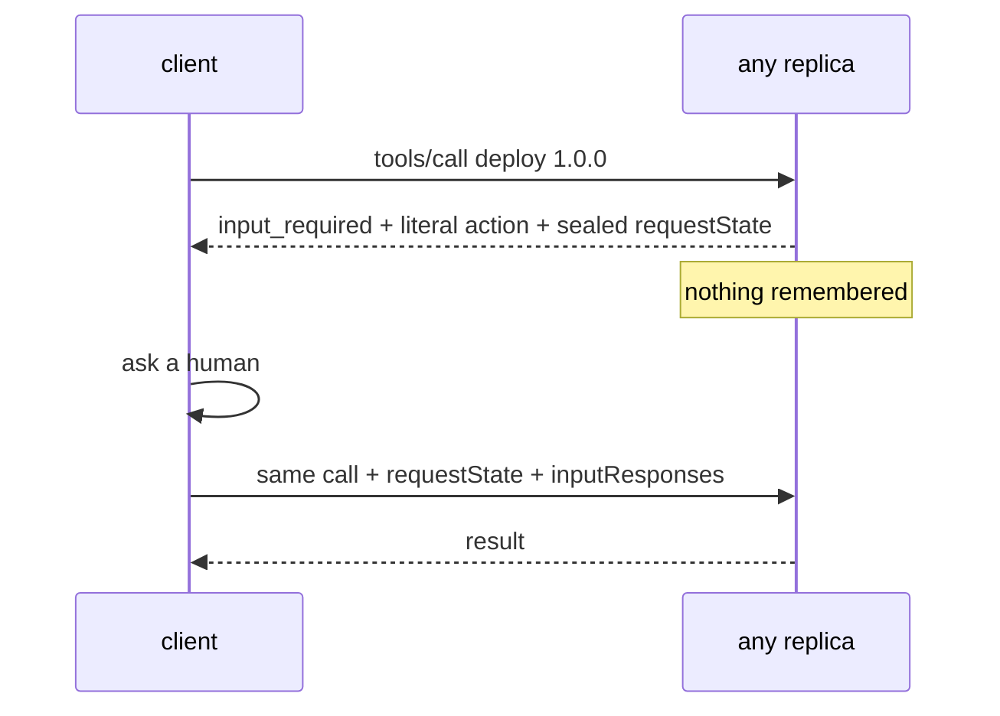

# MCP

Frey speaks the **stateless `2026-07-28` revision**, in both directions, with a shim for older
servers.

## What changed in this revision

It deleted the stateful core. No handshake, no `Mcp-Session-Id`, no SSE resumability. Server-initiated
requests were replaced entirely by a retry pattern. Listings carry `ttlMs` and `cacheScope`. Roots,
sampling and logging are deprecated.

The consequence worth internalising: **a request carries everything needed to serve it**, so any
instance can answer any request and horizontal scaling is free.

## Being a client

```rust
let client = McpClient::new("github", transport);
let identity = client.negotiate().await?;
let catalog = client.list_tools().await?;
let result = client.call_tool("list_issues", args).await?;
```

`Transport` is one method — send a `Request`, get a `Value` — so the whole client is testable against
a fake with no network and no server.

**An MCP server is an untrusted party and the client is built that way:**

- **Listings are re-sorted.** The spec asks servers to be deterministic to protect prompt caches.
  A server that ignores it would churn your tool block's hash every turn and *you* pay for that, so
  the client defends itself.
- **Freshness hints are capped** at an hour. A `ttlMs` of a year would pin a stale catalog.
- **Catalogs are private by default.** Sharing across principals when the server did not say it was
  safe leaks one user's tools to another.
- **Results are `Untrusted`**, with provenance naming the server and tool.
- **A method-not-found for `server/discover` is negotiation, not failure.** It is how a
  pre-stateless server identifies itself; treating it as an error would make every existing server
  unusable.

## Being a server

Any `Toolset` becomes an MCP server:

```rust
use frey::mcp::server::Server;

let server = Server::new("thicket", "0.1.0", my_toolset)
    .instructions("Graph-shaped memory. Connect facts with `relate`.")
    .ttl_ms(Some(300_000))
    .cache_scope(CacheScope::Private);

let reply: Option<Value> = server.handle(&request).await;
```

**There is no transport.** `handle` takes a JSON value and returns one, so the entire protocol is
testable without a socket and stdio or HTTP is a dozen lines you write. `None` means the message was
a notification and JSON-RPC forbids answering it.

Stdio, complete:

```rust
while let Some(line) = lines.next_line().await? {
    if let Some(reply) = server.handle(&serde_json::from_str(&line)?).await {
        stdout.write_all(reply.to_string().as_bytes()).await?;
        stdout.write_all(b"\n").await?;
        stdout.flush().await?;   // a buffered reply is a hang, from the client's side
    }
}
```

HTTP is one `axum` route — see
[switchboard](https://github.com/newsbubbles/switchboard/blob/main/src/http.rs).

The server also: sorts its listing so it does not churn *your* clients' caches, validates arguments
against the declared schema before dispatch, returns tool failures as results with `isError` rather
than JSON-RPC errors, and answers `initialize` as a compatibility shim for pre-stateless clients.

### `cacheScope` is a security decision

`Public` authorises a shared intermediary to serve one principal's listing to another. Default is
`Private`. Only widen it when the catalog genuinely does not vary by caller, and make it a decision
somebody made rather than a default somebody inherited.

## Approvals

The multi round-trip pattern is what makes statelessness possible. Rather than calling back to the
client, a tool returns what it needs plus a sealed token; the client **re-sends the same call** with
answers attached.



In a tool:

```rust
match &cx.resume {
    None => ToolOutcome::NeedsInput(NeedsInput {
        token: "deploy".into(),
        requests: vec![InputRequest::Approval {
            literal: format!("deploy {service} version {version} to production"),
            risk: Risk::High,
        }],
    }),
    Some(resume) => match resume.answers.first().and_then(Value::as_bool) {
        Some(true) => do_it(),
        _ => ToolOutcome::Denied(…),
    },
}
```

Two rules that are easy to get wrong:

- **An absent answer is not a yes.** A retry carrying no responses must ask again, not proceed.
  Treating silence as consent turns an approval gate into a formality that logs nicely.
- **`literal` is the exact action, never a paraphrase.** A summary is where an instruction injected
  upstream survives review.

Because nothing is remembered between the two calls, the ask and the answer can land on different
replicas. switchboard's test suite
[proves this](https://github.com/newsbubbles/switchboard/blob/main/tests/stateless.rs) by
round-robining the handshake across two servers.

## Statelessness is not the absence of data

Your database is fine. What no replica may hold is anything about *who is calling* or *what they
asked last time*.

## Why not an SDK

ADR-0020. The wire format is JSON-RPC over an HTTP client that already existed; what Frey actually
needed was the *policy* around it — negotiation, catalog caching, defensive re-sorting, namespacing,
and mapping `input_required` onto one `NeedsInput` type shared with A2A and AG-UI. No SDK provides
that, and implementing the wire directly made the whole client testable against a fake transport.
