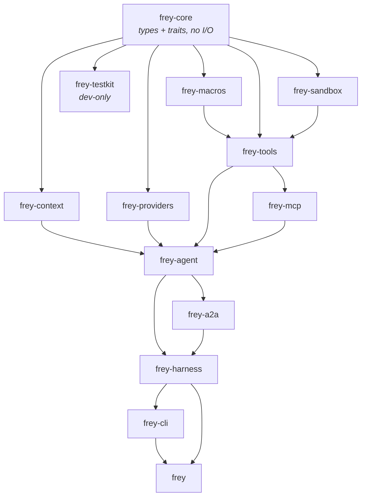
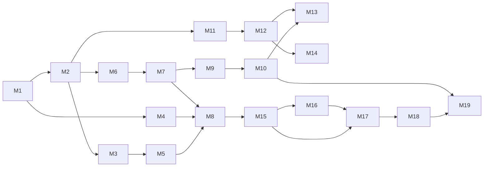

# Frey — Sequential Build Plan

*Written 2026-08-08. The order is derived from real compile-time dependencies, not from
enthusiasm. Each milestone states what it needs, what it delivers, and the test that says it is
done. Nothing is started before the thing it depends on is green.*

---

## 0. The two sequencing rules

1. **Nothing depends on something that does not compile yet.** Obvious, routinely violated.
2. **Test infrastructure precedes the thing it tests.** `frey-testkit` lands before the first
   provider, not after, because a provider written without a `ScriptedModel` will be written
   against a live API and will never be properly tested afterwards.

A third rule falls out of the first two: **the pure, I/O-free parts come first.** The cache planner
is the framework's headline feature *and* has no dependencies beyond types — so it can be finished,
benchmarked, and proven before a single HTTP request exists.

---

## 1. Revised crate graph — contracts live in core

The one architectural change this plan makes to `architecture/00-overview.md`: **the traits move
into `frey-core`** alongside the types. `frey-core` becomes a *contracts* crate in the style of
`http` or `tower-service` — types plus trait definitions, no implementations, no I/O.

Why: `frey-testkit` needs `ModelProvider` to write a fake, and `frey-agent` needs it to drive the
loop. If the trait lives in `frey-providers`, both take a dependency on reqwest, rustls, and every
provider's wire format in order to define a struct with three fields. Recorded as **ADR-0019**.

Dependency edges are one-way and acyclic. `frey-testkit` is a dev-dependency of everything above
it and ships as a normal crate so downstream users can test *their* agents with it.

---

## 2. Milestones

Legend — **DoD** = definition of done; a milestone is not done until its named test is green,
`cargo clippy -- -D warnings` is clean, and the docs for the new public surface compile.

### Phase A — Foundations

#### M0 · Workspace + taint + audit + errors — ✅ **done**
Delivered: workspace, `Tainted<T, I, C>` lattice, audit trail with call-site capture, the
audience-typed error model. 28 tests. ADR-0011 resolved.

#### M1 · Core vocabulary
*Depends:* M0. *New deps:* `schemars`.

The nouns every other crate uses. All pure data.

- `ids` — `RunId`, `TurnId`, `SessionId`, `ContextId`, `CallId`, `ToolName`, `ProviderId`,
  `ModelId`, `ServerId`, `AgentId`, `SegmentId`, `AgentPath`. Newtypes, `Display`, serde.
  **Ids are derived from journal sequence, never random** — replay depends on it.
- `item` — `Item`, `Turn`, `Role`, `Caller`, and the seven item variants including `Opaque`
  (`Box<RawValue>`, byte-preserving).
- `usage` — `Usage`, `Money`, `CostEstimate`, `PricingSource`, `Confidence`.
- `capability` — `Capability`, `Grant`, `PathScope`, `HostPattern`, `ProgramScope`, `Budget`,
  `Authority`, `GrantSet::is_subset_of`, `SessionPowers::check` (Rule of Two).
- `tool_def` — `ToolDefinition`, `ToolExample`, `PresentationHint`, `CallerPolicy`, `CostHint`.
- `provider_caps` — `ProviderCapabilities`, `ToolSearchSupport`, `CacheSupport`,
  `ReasoningSupport`, `StrictSupport`, `Modality`.
- `segment` — `Segment`, `SegmentKind`, `Stability`, `CacheMark`, `CacheTtl`, `ContentHash`
  (a value type; the *hashing* lives in `frey-context` so core stays dep-light).
- `event` — `Event`, `Event::is_droppable`.

**DoD:** `Opaque` survives `serde_json` round-trip byte-for-byte (property test over generated
JSON); `GrantSet` narrowing is a proven partial order (reflexive, antisymmetric, transitive);
`SessionPowers` rejects exactly the all-three case; `Event::is_droppable` is true only for the two
delta variants.

#### M2 · Core contracts
*Depends:* M1. *New deps:* `futures-core`, `dynosaur`.

`ModelProvider`, `AgentProvider`, `Tool`, `Toolset`, `CapabilitySearch`, `SandboxBackend`,
`AuditSink` (already exists), plus `Request`/`Response`/`StreamEvent` and `ProviderError`.

**DoD:** each trait has a trivial in-crate implementation used only to prove object safety and the
`dynosaur` erasure compiles; `ProviderError` classifies 401/402/403 as fatal and non-retryable.

#### M3 · `frey-testkit`
*Depends:* M2.

- `ScriptedModel` — a `ModelProvider` returning canned responses, **with assertions on what it
  received**: tool block contents, cache marks, item order, `Opaque` round-trip.
- `Cassette` — record/replay format for real provider traffic, with redaction.
- `FakeToolset`, `FakePeer`, `HostileMcpServer` (bad ordering, lying `ttlMs`, injected text in
  descriptions) — the last one lands with M9, its interface is defined here.
- `assert_audit!` and `assert_events!` helpers.

**DoD:** a test using `ScriptedModel` can assert "the model saw exactly these tools, in this order,
with a cache breakpoint after segment 2" without any network.

### Phase B — The wedge

#### M4 · `frey-context` I — budget + cache planner
*Depends:* M1, M3. *New deps:* `blake3`.

The pure functions. `Budgeter`, `CachePlanner::plan(&catalog, &history, &caps) -> CachePlan`,
segment hashing, the warning catalogue from `architecture/03-context-engine.md` §6.

**DoD:** property test over generated catalogs × 6 provider profiles proving no provider rule is
ever violated (≤4 breakpoints, 1h-before-5m, prefix ≥ per-model minimum, never on a deferred tool);
`ChurnDetected` fires on a system prompt containing a clock and not on a stable one; the budgeter
provably never exceeds `window − reserve_output`; golden plan snapshots committed.

> This milestone is the framework's central claim. It ships early and stays benchmarked.

### Phase C — Talking to models

#### M5 · `frey-providers`
*Depends:* M2, M3, M4. *New deps:* `reqwest`, `tokio`, `eventsource-stream` (or hand-rolled SSE).

Order within the milestone matters:
1. **Transport** — HTTP client, retry with the error taxonomy, and an **SSE reader that tolerates
   keepalive comment frames before the body** (a verified real-world failure; a bare `.json()`
   intermittently throws on HTTP 200).
2. **Anthropic** — Messages API, `cache_control` realisation, `defer_loading`, `allowed_callers`,
   the `usage` mapping including nested `cache_creation`.
3. **OpenAI** — **Responses API first**, typed items, `reasoning` items with `encrypted_content`
   replayed verbatim, `prompt_cache_options`/`prompt_cache_key`.
4. **OpenRouter** — always-on usage accounting, `session_id` sticky routing, per-provider
   explicit-vs-automatic caching, **402 fatal**.
5. **Config-defined providers** — the `dialect` mechanism, so R3 is met without writing Rust.

**DoD:** per provider, a cassette round-trip test proving `raw → Vec<Item> → raw` is byte-identical;
a cache-realisation test proving the `CachePlan` from M4 produces the correct wire fields; injected
401/402/403 never retried.

### Phase D — Tools

#### M6 · `frey-macros`
*Depends:* M1. *New deps:* `syn`, `quote`, `proc-macro2`.

`#[frey::tool]` → `ToolDefinition` + `schemars` schema, **parameter doc comments become
`description` fields** (they are what tool search matches on), capability and caller declarations.

**DoD:** a trybuild UI suite covering the error cases (missing description, undocumented param,
unsupported argument type) with diagnostics a coding agent can act on.

#### M7 · `frey-tools` I — the tower stack
*Depends:* M2, M6. *New deps:* `tower`.

`ToolStack::production()` = Namespace → Filter → Policy → Approval → Retry → Timeout →
Concurrency → Cache → Redact → Audit. (Sandbox layer slots in at M11.)

**DoD:** layer ordering asserted by trace; each layer unit-tested in isolation; a property test
proving no tool can execute without a matching grant.

### Phase E — First agent

#### M8 · `frey-agent` I — loop, journal, replay, tracing
*Depends:* M4, M5, M7. *New deps:* `tracing`, `tracing-subscriber`, `tracing-opentelemetry`,
`opentelemetry`.

The run loop; the append-only journal; `replay` mode; `UsageLedger`; `gen_ai.*` spans.

**DoD:** **first end-to-end run** against a live provider behind a feature flag; 50 recorded runs
each replay 100× to identical item sequences; a mutated prompt diverges at the exact expected step.

> 🎯 *First demo point.* After M8 there is a real agent: model + tools + context + cost + replay.

### Phase F — Tools from the world

#### M9 · `frey-mcp`
*Depends:* M7. *New deps:* `rmcp` 3.x.

Client for 2026-07-28 (stateless, `server/discover`, `_meta`, `CacheableResult`,
`subscriptions/listen` only on demand), the `compat` shim for 2025-11-25, MRTR → `NeedsInput`,
OTel `traceparent` in `_meta`, catalog cache persisted to disk. Server side: expose any `Toolset`.

**DoD:** three servers (2026-07-28, 2025-11-25, `server/discover`-404) converge on one internal
catalog; `HostileMcpServer` cannot churn the stable prefix or smuggle unlabelled text into a prompt.

### Phase G — Discovery at scale

#### M10 · `frey-context` II — presentation + discovery
*Depends:* M4, M5, M9.

Presenter (`Always`/`Deferred`/`CodeOnly`/`Hidden`), `CapabilitySearch` (regex, BM25, embedding),
delegation to provider-native tool search, inline injection after the breakpoint when emulating.

**DoD:** 500-tool synthetic catalog — planted target in top-5 for ≥ the agreed hit rate per search
kind; emulated discovery and native `defer_loading` yield the same tool set on a recorded session;
**the context-reduction benchmark runs in CI and its number goes in the README.**

> 🎯 *First headline number, measured by us, on a harness anyone can clone.*

### Phase H — Security

#### M11 · `frey-sandbox`
*Depends:* M2. *New deps:* `landlock`, `seccompiler`, `windows`, `wasmtime` (feature-gated per OS).

Backends: Linux (Landlock ABI detected at runtime + seccomp + user-notify supervisor), Linux
fallback (userns + seccomp + setrlimit), macOS Seatbelt, Windows AppContainer + restricted token +
Job object, wasmtime. One `SandboxReport` shape. **Fail-closed.**

**DoD:** the red-team corpus (traversal, symlink escape, DNS rebinding, env exfiltration, obfuscated
destructive commands) is denied *and reported* on every backend; a host with no usable backend
errors instead of running; the older-kernel CI runner exercises the degradation path.

#### M12 · `frey-tools` II — the built-in toolset
*Depends:* M11.

`SandboxLayer`; `fs_read`/`fs_list`/`fs_write`, `shell` (argv only), `shell_script` (AST
allowlist), `http_get`/`http_post` (egress allowlist), `grep`. Plus the shipped validators:
`WorkspacePath`, `AllowedUrl`, `ShellArgv`, `Json<T>`.

**DoD:** every built-in tool is written without naming a taint label (the M0 criterion, retested at
scale); each has a red-team case.

### Phase I — Token efficiency

#### M13 · `frey-context` III — skills
*Depends:* M10, M12.

`SKILL.md` loader, the four-level progressive-disclosure ladder, digest pinning, signature
verification, trusted-roots policy, bundled scripts as sandboxed tools.

**DoD:** only level 0 loads until a task matches; a malicious `SKILL.md` from an untrusted root
arrives `LowIntegrity` and cannot grant itself capabilities.

#### M14 · `frey-context` IV — code mode
*Depends:* M12, M5. *New deps:* `rquickjs`.

TypeScript `.d.ts` codegen from the catalog (generated always — it doubles as the search corpus);
`rquickjs` runtime, one per execution on `spawn_blocking`, memory/stack/interrupt limits; host
functions as capability bindings; delegation to provider-native PTC when available.

**DoD:** runaway loop hits the interrupt handler; allocation bomb hits the memory limit; no
filesystem or network reachable from a script; the token-saving benchmark is measured and published.

### Phase J — Many agents

#### M15 · `frey-agent` II — multi-agent
*Depends:* M8, M11.

Sub-agents, `AgentProvider` subprocess adapters for `claude` and `codex`, the four orchestration
primitives, `Arc<ContextSnapshot>` inheritance, event fan-out with the droppable-delta rule,
cross-process trace propagation.

**DoD:** grant monotonicity property test over random spawn trees; leaf deltas reach the root and
drop under backpressure while semantic events never do; no orphan processes after cancel; the root
span is an ancestor of a span emitted by an MCP server in a separate process.

#### M16 · `frey-a2a`
*Depends:* M15.

JSON-RPC binding (gRPC and REST feature-gated), signed agent cards, the 8-state task lifecycle,
streaming fan-out semantics, push-notification configs as an egress capability.

**DoD:** all 8 states reachable; terminal states end the stream; N concurrent subscribers see
identical ordered events and closing one does not disturb the others; unsigned peer text is
`LowIntegrity`.

### Phase K — Harness

#### M17 · `frey-harness`
*Depends:* M8, M15, M16.

`Harness` builder, the five surfaces, sessions-as-journals with fork, approvals showing literal
actions, AG-UI serialisation of the event bus, shared state via JSON Patch.

**DoD:** headless + interactive approvals fails at *build* time; one run streams to CLI + AG-UI +
A2A consistently; session fork replays the shared prefix without re-calling the provider.

#### M18 · `frey-cli`
*Depends:* M17.

`init`, `run`, `chat`, `doctor`, `tools`, `caps`, `cost`, `replay`, `mcp`, `a2a`, `record`.

**DoD:** `frey doctor --json` output is schema-stable (it is an agent-facing API); every command
has tested `--help` text and a docs example.

### Phase L — Release

#### M19 · Facade, docs, benchmarks, publish
*Depends:* everything.

`frey` facade + prelude + feature flags; the config JSON Schema published; the book; examples as
compiled tests; the benchmark suite with committed baselines; **re-run the wedge adversarial search
before the README goes public** (research 03 §2).

**DoD:** an LLM given only the published JSON Schema and the prelude writes a working agent — the
standing R13 regression test.

---

## 3. Critical path

Off the critical path and therefore safe to defer if something slips: **M11/M12** (sandbox) can lag
until after M10 without blocking the first demo; **M16** (A2A) only gates the harness's A2A surface;
**M14** (code mode) gates nothing downstream.

On the critical path and therefore not negotiable: **M1 → M2 → M3 → M5 → M8**. Everything
interesting is downstream of a working loop.

---

## 4. Decisions already pre-committed, so no check-in is needed

To keep the build continuous, these are settled; each can be revisited via a new ADR if the code
argues otherwise.

| Question | Pre-committed answer |
|---|---|
| Async runtime | `tokio`, multi-thread; `frey-core` stays runtime-agnostic |
| HTTP client | `reqwest` with `rustls` (no OpenSSL) |
| Dyn erasure | native AFIT + `dynosaur` at coarse boundaries only |
| Serialisation | `serde`; `Box<RawValue>` for `Opaque`; `schemars` for JSON Schema 2020-12 |
| Hashing | `blake3` in `frey-context`; `ContentHash` is a plain value type in core |
| Search | regex + BM25 hand-rolled in-process; embeddings behind a trait, no bundled model |
| Code-mode engine | `rquickjs`, one `Runtime` per execution on `spawn_blocking`; V8 feature-gated |
| Vector stores | **not in scope**; one trait, no bundled adapters |
| Durable execution | run journal only; Temporal/Restate are post-1.0 adapters |
| Versioning | `0.x` until M19; breaking changes allowed and changelogged until then |
| MSRV | current stable minus nothing (1.94); bumped freely before 1.0 |

## 5. The only things likely to need the operator

1. **Publishing to crates.io** and reserving the name — needs credentials.
2. **The public README's headline numbers** — I will measure them, but the claim wording is a
   positioning call.
3. **Anything requiring a paid API key** for tier-6 live tests.
4. A decision at **M11** if a platform backend turns out to be infeasible in the time available —
   dropping a platform is a product call, not an engineering one.

Everything else proceeds without a check-in.
