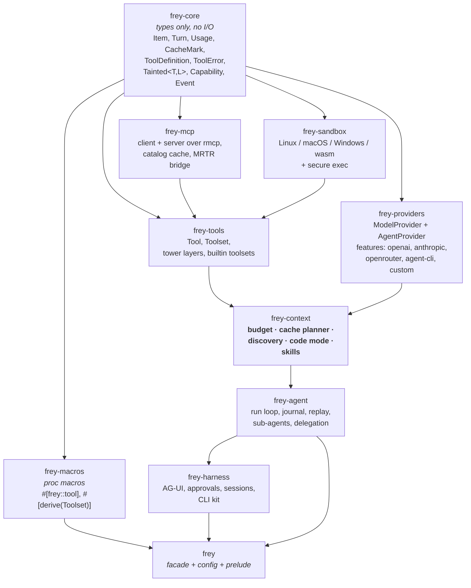
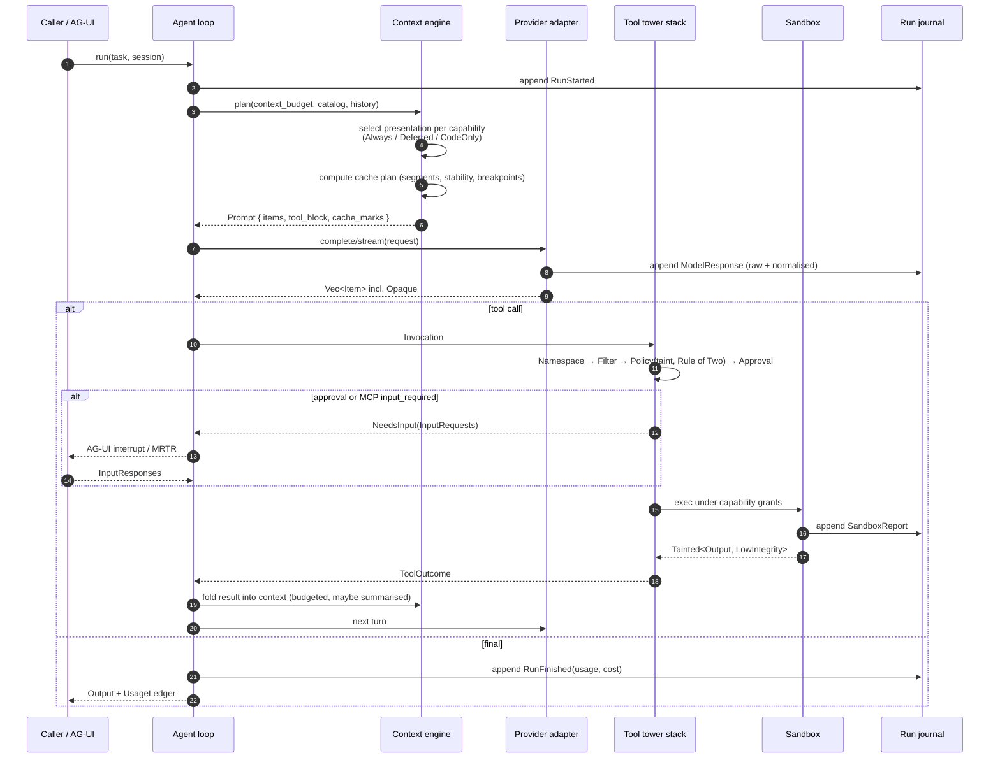
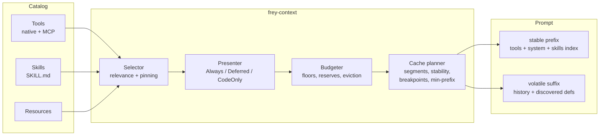
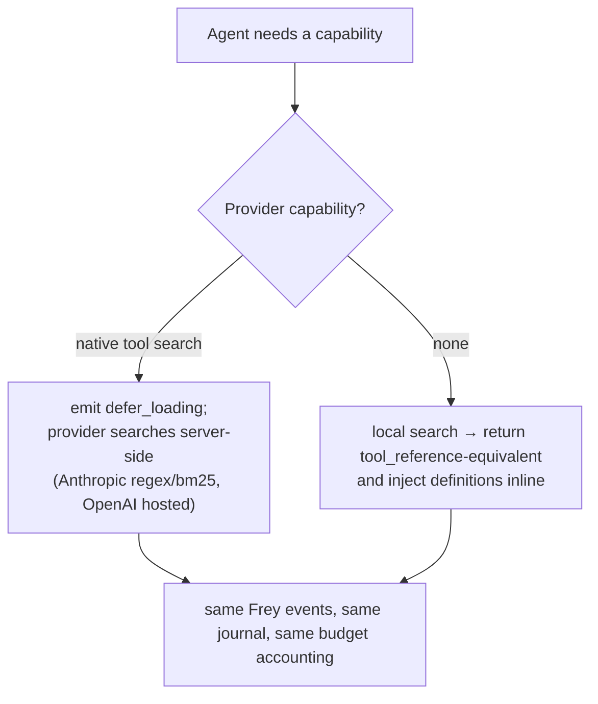
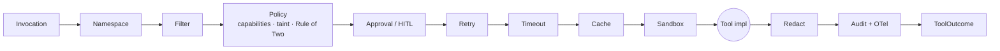
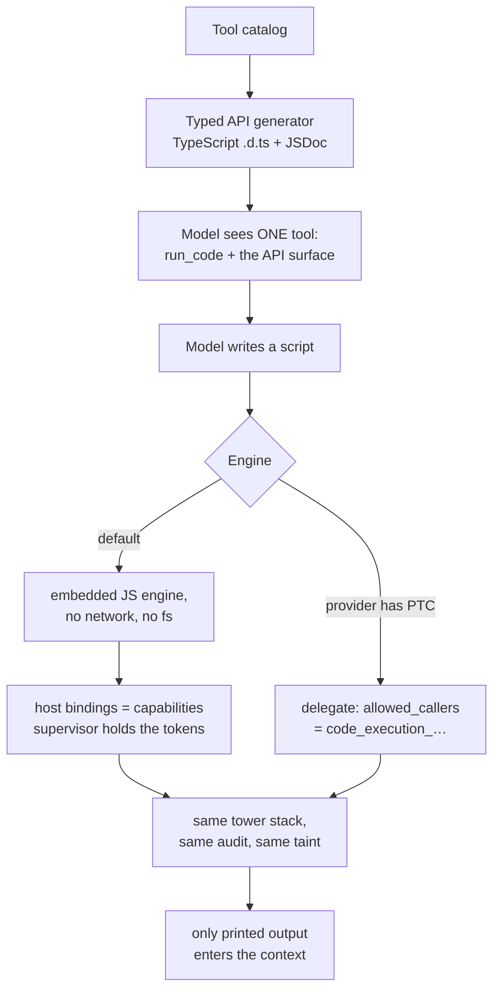

# Frey — Architecture Overview

*Draft 1, 2026-08-08. Derived from `notes/00-seed-requirements.md` and `notes/research/01–05`.*

---

## 1. The one-sentence claim

> **Frey is the Rust agent framework where the context window is a managed resource — with a
> budget, a cache plan, and a provenance label — and where tools, skills, and code-mode are three
> presentations of one progressively-disclosed capability catalog.**

Three pillars, each mapping to something the ecosystem measurably lacks (research 03):

| Pillar | Claim | Why nobody has it |
|---|---|---|
| **Context economy** | Tool/skill definitions are *planned* into the prompt against a per-model cache and budget model, not dumped at startup | Requires it in the core types; can't be bolted onto `Vec<Message>` + `HashMap<String, Tool>` |
| **Provable-ish security** | Capability grants, cross-platform sandbox, information-flow labels **as Rust types**, enumerable declassification points, one audit record shape | Python can only check at runtime; Rust checks at compile time. FIDES showed IFC *raises* task success by 16% |
| **Harness-grade runtime** | Deterministic replay from an event-sourced journal, OTel across sub-agent boundaries, AG-UI out of the box, delegate to `claude`/`codex` as sub-agents | Every survey lists these as the ecosystem's missing pieces |

Non-goals, stated up front so they don't creep: Frey is **not** an agent operating system
(that's OpenFANG), not a vector-store zoo (that's Rig), not a workflow engine (that's
Temporal/Restate — we adapt to them, we don't rebuild them).

---

## 2. Design principles

1. **Lossless before lossy.** Every provider response parses into our item model with unknown
   blocks preserved as `Opaque` and round-tripped byte-for-byte. Normalisation never deletes.
2. **Capabilities are declared, not discovered.** A tool states what it needs; the runtime decides
   whether it may have it. No ambient authority anywhere.
3. **Fail closed and loud.** No sandbox ⇒ error, not "running unsandboxed 🤷". Fatal auth/billing
   errors (401/402/403) never enter a retry loop.
4. **Errors are typed by *audience*.** Model-facing guidance, operator diagnostics, and user
   presentation are three different fields, never one string.
5. **The model is a caller, not an oracle.** Anything it produces is untrusted input to the next
   stage — including a sub-agent's output.
6. **Everything the agent sees is budgeted.** If it costs tokens, it has an owner, a size, a
   stability class, and a place in the cache plan.
7. **Agent-legible by construction (R13).** One obvious way to do each thing; doc examples are
   compiled tests; config has a published JSON Schema; error messages say what to do next.
8. **Rust's strengths, not Rust's cosplay.** Use `tower`, the type system, and `?Send`-aware
   async because they make the design *possible*, not because they make benchmarks pretty.

---

## 3. Crate graph



Rules: dependencies point **one way**; `frey-core` depends on `serde`, `schemars`, `thiserror`
and nothing else; every crate above it is independently testable; the facade re-exports a
`prelude` so the 90% case is `use frey::prelude::*;`.

Target ~10 crates. ADK-Rust's 22 is the cautionary tale ("complexity of maintaining 22 crates,
steep learning curve, documentation quality concerns" — research 03).

---

## 4. The run loop, end to end



Two things in that diagram are unusual and deliberate:

- **`NeedsInput` is one type** serving human approval, MCP `input_required` (MRTR), AG-UI
  interrupts, frontend-executed tools, and durable suspension. Research 03 §3 argued these are
  the same shape; unifying them collapses four subsystems into one.
- **The context engine runs *before every turn*, not once at startup.** Presentation decisions
  are per-step, exactly like pydantic-ai's `for_run_step()` — but here they are also
  cache-plan-aware.

---

## 5. The context engine (the thing that makes Frey Frey)



### 5.1 Presentation modes
Every capability in the catalog gets one of:
- **`Always`** — full definition in the stable prefix. Reserved for the 3–5 hottest
  (Anthropic's own guidance: keep your 3–5 most-used tools non-deferred).
- **`Deferred`** — name/description indexed for search; definition injected on discovery.
  Maps to Anthropic `defer_loading: true` natively; emulated elsewhere.
- **`CodeOnly`** — never presented as a callable tool; only reachable from code mode.
  Maps to Anthropic `allowed_callers: ["code_execution_…"]`.
- **`Hidden`** — present in the registry, invisible this step (policy or filter).

### 5.2 Discovery
`trait CapabilitySearch` with three shipped impls — `Regex`, `Bm25`, `Embedding` — and a
**delegation rule**:



We use Anthropic's documented **custom tool search** hook (`tool_result` containing
`tool_reference` blocks) so our embedding search rides their expansion machinery rather than
fighting it. Where a provider has nothing, we inject definitions inline **after** the cache
breakpoint so the stable prefix is untouched — the same trick Anthropic uses internally.

### 5.3 Cache planner
Owns everything research 02 §1–2 turned up:
- per-model **minimum cacheable prefix** table (512 / 1,024 / 2,048 / 4,096 …) — below it,
  caching silently does nothing, so we *tell the developer* instead of shrugging;
- **≤4 breakpoints** on Anthropic, one consumed by automatic caching;
- **1h-TTL entries must precede 5m entries**;
- prefix order `tools → system → messages`, with invalidation cascading forward;
- OpenAI: `prompt_cache_options.mode`, `ttl`, and `prompt_cache_key` (with the ~15 rpm/key
  guidance surfaced as a monitored budget);
- OpenRouter: whether the routed provider needs explicit `cache_control` at all, plus
  `session_id` for sticky routing.

Its headline behaviour: **hash each segment every turn and refuse to place a breakpoint on a
segment that changed last turn**, emitting a `frey.cache.churn` warning naming the culprit
(e.g. "a timestamp in your system prompt is costing you ~$41/day"). Nothing else does this,
and it is the most immediately *felt* feature in the framework.

---

## 6. Tools: one registry, `tower` all the way down



Native tools, MCP tools, skill-provided scripts, and sub-agents are all `Tool` implementations
behind the same stack. That is what makes "swap an MCP server for a local function" a one-line
change, and what makes the security layers unavoidable rather than opt-in.

---

## 7. Security architecture

```mermaid
flowchart TD
    subgraph Types["compile time — frey-core"]
        TT["Tainted&lt;T, Label&gt;<br/>integrity × confidentiality"]
        DC[declassify() — explicit,<br/>enumerable, logged call sites]
    end
    subgraph Policy["runtime — frey-tools PolicyLayer"]
        CAP[Capability grants:<br/>fs:read/write, net:egress,<br/>exec, secret, spend]
        R2["Rule of Two:<br/>untrusted ∧ confidential ∧ mutating<br/>⇒ escalate or refuse"]
    end
    subgraph Exec["execution — frey-sandbox"]
        LX[Landlock + seccomp + user-notif]
        MC[Seatbelt SBPL]
        WN[AppContainer / restricted token + Job]
        WA[wasmtime: fuel + epoch]
    end
    subgraph Egress
        PX[deny-all proxy;<br/>hostnames resolved once at start]
    end
    TT --> Policy --> Exec --> Egress
    Exec --> AUD[(append-only audit log<br/>one SandboxReport shape)]
```

Concretely, an auditor asking "show me every place untrusted data becomes trusted" gets
`grep declassify` plus a runtime log of every such event with file:line. Asking "what could this
agent have exfiltrated" gets the egress allowlist and the proxy log. Asking "what did the shell
tool actually run" gets `argv`, not a reconstructed string.

The **secure shell tool** (R5) takes `argv: Vec<String>` — never an interpolated command string —
runs under a sandbox backend or refuses, starts from an **empty environment**, holds **no
credentials** (secrets are capability bindings resolved by the supervisor, per Cloudflare's
Code Mode insight), and returns `Tainted<String, LowIntegrity>` with truncation that tells the
model exactly how much was cut and how to get the rest.

---

## 8. Code mode



Reported gains for the pattern: Cloudflare **−32% simple / −81% batch**; Anthropic PTC
**+11% accuracy with −24% input tokens**. The generated `.d.ts` is *also* the best possible
documentation for the model, which is why we generate it even when code mode is off (it becomes
the deferred-tool description corpus for search).

---

## 9. Providers

Two kinds, and the distinction is load-bearing (research 02 §4):

- **`ModelProvider`** — an endpoint that completes tokens. `openai` (Responses API first),
  `anthropic` (Messages), `openrouter`, plus **config-defined** adapters: a `frey.toml` entry
  naming a wire dialect (`openai_responses` | `openai_chat` | `anthropic_messages`), base URL,
  auth, capability overrides, and pricing. That is how R3's "extensible via configuration" is met
  without writing Rust.
- **`AgentProvider`** — an external agent process that already owns its auth, tools, sandbox and
  loop: `claude` (Agent SDK / `claude -p`), `codex`. Frey **delegates** a task and consumes the
  event stream. **Frey never stores, mints, or replays a vendor subscription OAuth token** —
  Anthropic prohibits third-party subscription OAuth (2026-02-20) and OpenAI's path is
  semi-official for personal use only. Documented as a deliberate boundary.

`ProviderCapabilities` is the anti-lying mechanism: `tool_search: Native|Emulated|None`,
`programmatic_tool_calling`, `cache: Explicit{max_breakpoints, ttls, min_prefix}|Automatic|None`,
`reasoning: None|Opaque|Encrypted`, `strict_schema`, `parallel_tool_calls`, `modalities`,
`max_context`. The agent asks, then degrades **explicitly and visibly** — never silently.

---

## 10. Usage, cost, and the ledger

Every call appends to a `UsageLedger` keyed by `(run, turn, provider, model, tool)`:
`input`, `output`, `cache_read`, `cache_write`, `reasoning`, `cost: Option<Money>`, `raw`.

Rules: never invent a cost the provider didn't report — report `None` and let a separate,
clearly-labelled pricing table produce an *estimate*. Token counts across providers are not
comparable (OpenRouter uses each model's native tokenizer); **cost is the only comparable unit**.
The ledger is exported as OTel `gen_ai.*` metrics and dumped as JSON at run end, so
`frey run --explain-cost` can say where the money went.

---

## 11. Observability & replay

- `tracing` → `tracing-opentelemetry`, `gen_ai.*` semantic conventions, `frey.*` for the novel
  bits (cache plan, budget, taint, capability decisions).
- MCP 2026-07-28 standardised `traceparent`/`tracestate`/`baggage` in `_meta` — Frey injects
  outbound and extracts inbound, so an agent → tool → MCP-server trace is one waterfall.
- Sub-agent spans attach to the parent whether in-process, in another task, or in a child process.
- **Run journal**: every non-deterministic effect appended with a sequence id ⇒ `frey replay`
  reruns a transcript deterministically, diverging loudly at the exact step. This is the surveyed
  gap #4 and it is nearly free once the journal exists.

---

## 12. Harness layer

`frey-harness` turns an agent into the thing people actually ship in 2026:
AG-UI event stream (the internal event bus **is** the AG-UI model, so there is no adapter),
approval/interrupt handling, session persistence, transcript export, and a CLI kit
(`frey init`, `frey run`, `frey replay`, `frey doctor`, `frey cost`, `frey tools`).

`frey doctor` deserves special mention: it checks sandbox availability per platform, provider
auth, MCP server reachability and protocol revision, cache-plan sanity, and tool-description
quality (params without docs are invisible to tool search). It is the fastest possible way for a
coding agent to diagnose a Frey project without reading the source.

---

## 13. Open questions for the next pass

1. Which embedded JS engine for code mode — QuickJS (`rquickjs`) vs `deno_core`/V8 vs a
   WASM-component runtime? Needs a real spike measuring startup, memory, and API ergonomics.
2. Does `rmcp` expose `CacheableResult`, MRTR, and `server/discover` as types we can build on
   directly, or do we need our own layer over it? **Read the source before deciding.**
3. How far can `Tainted<T, L>` go before it poisons ergonomics? Needs a prototype on a real tool.
4. A2A: implement in v1 or declare "planned"? (Interop claims are cheap to make and expensive to
   keep.)
5. Licence: Apache-2.0 (matches Rig/OpenFANG) vs MIT/Apache dual. Pick before first commit.
