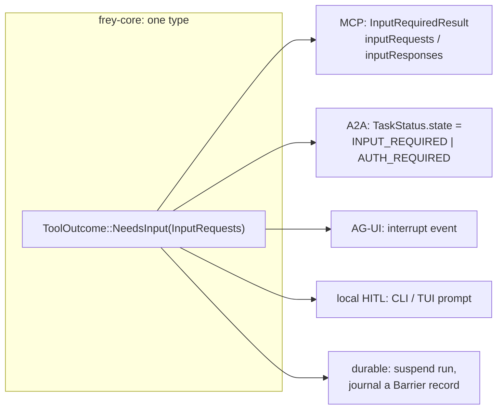
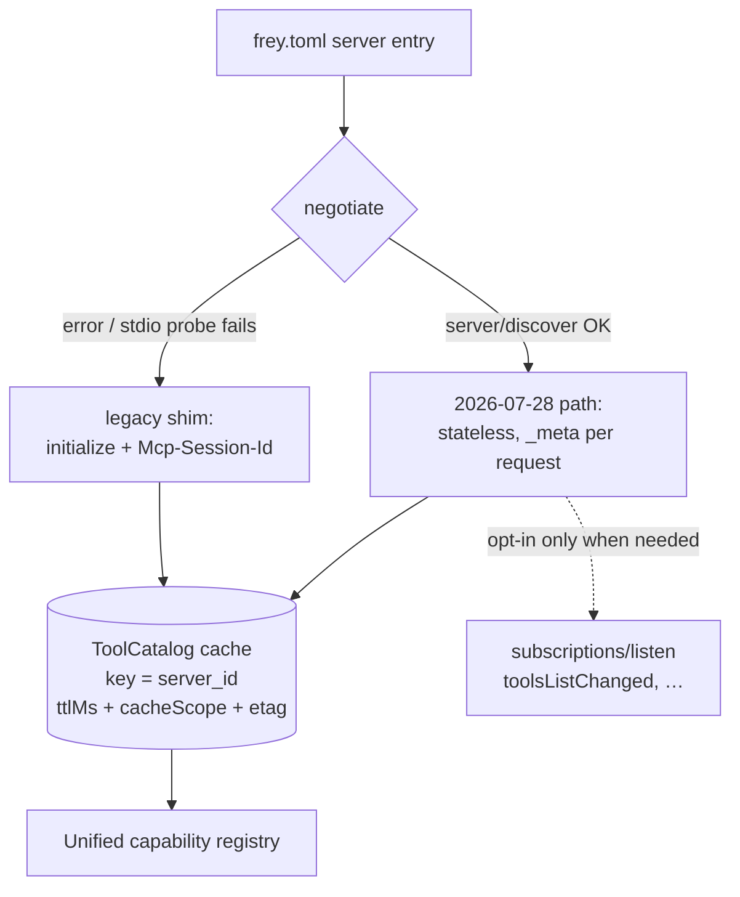
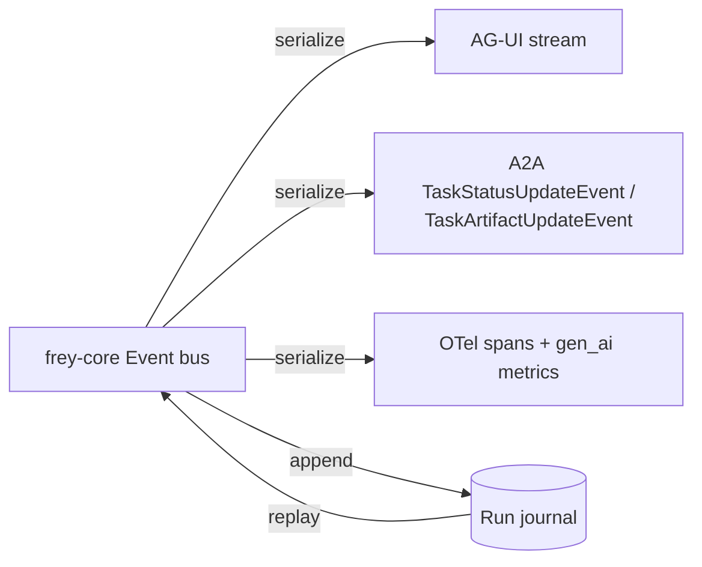

# Frey — Protocol Layer (MCP · A2A · AG-UI)

*Draft 1, 2026-08-08. Covers `frey-mcp`, `frey-a2a`, and the AG-UI projection in `frey-harness`.*

---

## 1. The convergence that shapes everything

Three protocols, three different committees, one identical concept:

| Protocol | "I cannot continue without something from outside" |
|---|---|
| **MCP 2026-07-28** | `resultType: "input_required"` + `inputRequests` → client retries the *original* request with `inputResponses` |
| **A2A v1.0** | `TASK_STATE_INPUT_REQUIRED`, `TASK_STATE_AUTH_REQUIRED` — *interrupted* states, non-terminal |
| **AG-UI** | *interrupt* — pause / approve / edit / retry / escalate mid-flow without losing state |

Frey models this **once**:

```rust
pub struct InputRequests {
    pub token: ResumeToken,          // opaque, sealed, carries our own requestState
    pub requests: Vec<InputRequest>,
}

#[non_exhaustive]
pub enum InputRequest {
    Approval { action: LiteralAction, risk: Risk },     // show argv/URL/SQL, never a summary
    Choice { prompt: String, options: Vec<Choice> },
    Form { schema: schemars::Schema },                  // MCP elicitation
    Auth { scheme: SecuritySchemeRef, resource: Url },  // A2A auth_required
    FrontendTool { name: ToolName, args: Json },        // AG-UI frontend-executed tool
    Credential { name: SecretName },                    // never fulfilled by the model
}

pub enum Resumption { Answered(Vec<InputResponse>), Denied(DenialReason), Expired }
```



Consequence: human approval, MCP elicitation, A2A auth challenges, frontend tool execution, and
durable suspension are **one code path with five projections**. That is the single biggest
structural saving in the design, and it is why A2A belongs in v1 rather than bolted on later.

---

## 2. MCP (`frey-mcp`)

### 2.1 Client — a catalog cache, not a session



Rules that fall out of the spec (research 01 §1):

- **Never open `subscriptions/listen` unless a change notification is actually required.**
  Statelessness is the point; a long-lived stream throws it away.
- Honour `ttlMs`; respect `cacheScope: "private"` by never sharing that catalog across principals.
- **Persist the catalog to disk** keyed by `(server, protocol_version, auth_principal)`.
  Stateless servers make this safe, and it turns cold start into a local read.
- **Deterministic ordering.** The spec's SHOULD exists to protect prompt caches; Frey re-sorts
  defensively by `(server_id, tool_name)` so a sloppy server can't churn our stable prefix.
- On a broken response stream: **re-issue with a new request id** (no `Last-Event-ID` any more)
  and journal the retry so replay stays honest.
- Inject `traceparent` / `tracestate` / `baggage` into `_meta` outbound; extract inbound.
  This is now spec-blessed, so agent → tool → server is one OTel waterfall.
- Per-request `_meta` carries `protocolVersion`, `clientCapabilities`, `clientInfo`, and
  `logLevel` — Frey sets `logLevel` **only** when the run's log level warrants it, because
  servers MUST NOT emit `notifications/message` otherwise.

### 2.2 Client — legacy shim

One module, `frey_mcp::compat`, owning the whole 2025-11-25 world: `initialize` handshake,
`Mcp-Session-Id`, HTTP+SSE transport, `resources/subscribe`, server-initiated
`sampling/createMessage` / `roots/list` / `elicitation/create`. It **normalises into the modern
model** — a server-initiated sampling request becomes `NeedsInput`, a roots request is answered
from configured workspace scopes. Isolated so it can be deleted on a schedule.

### 2.3 Server — Frey agents are MCP servers too

Any `Toolset` can be exposed over Streamable HTTP with `Mcp-Method` / `Mcp-Name` headers set,
`CacheableResult` hints emitted (`ttlMs` from the toolset's own volatility, `cacheScope` from
whether the listing depends on the caller), and cross-call state expressed as **server-minted
handles passed as ordinary tool arguments** — never as a session. Handles are sealed with
`RequestStateCodec`-style HMAC so a client cannot forge one.

### 2.4 Extensions
`io.modelcontextprotocol/tasks` (polling via `tasks/get`, client→server input via `tasks/update`)
maps onto the same run-journal machinery as A2A tasks. Declared via the `extensions` field on
capabilities; unknown extensions are ignored, never fatal.

---

## 3. A2A v1.0 (`frey-a2a`)

Released **2026-04-09**, Linux Foundation governance. Frey ships **both sides**.

### 3.1 What we implement

- **Transports**: JSON-RPC 2.0 over HTTP is v1 mandatory. gRPC and HTTP+JSON/REST bindings are
  feature-gated (`a2a-grpc`, `a2a-rest`) and must pass the *same* conformance suite —
  the spec's own requirement is "functional equivalence".
- **Discovery**: serve `/.well-known/agent-card.json`; consume the same from peers.
  `capabilities.extendedAgentCard` gates the authenticated `GetExtendedAgentCard` call.
  **Signed agent cards are verified by default**; an unsigned card from an unknown origin is
  low-integrity input and its `description`/`skills` text is `Tainted<_, LowIntegrity>` before it
  ever reaches a prompt. (Skills-registry supply-chain attacks are already published literature —
  research 04 §1.)
- **AgentCard** fields we populate: `name`, `description`, `provider`, `capabilities`
  (`streaming`, `pushNotifications`, `extendedAgentCard`), `skills[]` (from the Frey skill and
  tool catalog — one place where our catalog does double duty), `interfaces[]`,
  `securitySchemes` / `security`, extension URIs.
- **Task** (`id`, `contextId`, `status{state,message,timestamp}`, `artifacts[]`, `history[]`,
  `metadata`) is a projection of a Frey **run**; `contextId` maps to a Frey **session**.
- **Messages / Parts / Artifacts**: `Part` is a one-of over `text` | `url` | `raw` (base64) |
  `data` (arbitrary JSON) — a near-exact match for our `Item::{Text, Media, Opaque}`, so the
  projection is mechanical. Artifacts are run outputs; Messages are conversation.
- **Methods**: `SendMessage`, `SendStreamingMessage`, `GetTask` (+`historyLength`), `ListTasks`
  (cursor pagination, filters on `contextId` / `status` / `statusTimestampAfter`), `CancelTask`,
  `SubscribeToTask`, and the four `PushNotificationConfig` operations.
- **Service parameters**: emit `A2A-Version: 1.0`; treat a missing version as `0.3` per spec;
  honour `A2A-Extensions`.

### 3.2 Streaming semantics we must not get wrong

The spec is explicit and these become conformance tests:
- The first stream item is always the `Task` or `Message` object, then zero or more
  `TaskStatusUpdateEvent` / `TaskArtifactUpdateEvent`.
- **The stream MUST terminate when the task reaches a terminal state.**
- Events **MUST be broadcast to all active streams** for a task, in order.
- **Closing one stream MUST NOT affect other active streams.**

⇒ Frey's per-task event fan-out is a broadcast channel with per-subscriber backpressure, and the
drop rule from ADR-0015 applies: presentation deltas may be dropped, `TaskStatusUpdateEvent` may
not. `tasks/resubscribe` (`SubscribeToTask`) requires the journal to replay from a sequence id.

### 3.3 Security
Support `APIKey`, `HTTPAuth` (Basic/Bearer), `OAuth2` (auth-code, client-credentials, device-code),
`OpenIdConnect`, `MutualTls`. Push-notification webhooks always use plain HTTP with the configured
`AuthenticationInfo` — so **webhook targets are an egress capability**, subject to the same
allowlist as any other outbound call, and a `NeedsInput::Approval` is required to register one.

> **A2A's biggest risk is trust laundering:** a peer agent's output is *someone else's model
> output*, arriving with an authoritative-looking task envelope. Frey labels everything from a
> peer `LowIntegrity` regardless of transport security. TLS proves who said it, not whether it's true.

---

## 4. AG-UI (`frey-harness`)

Per ADR-0015 the internal event bus *is* the AG-UI model, so there is no adapter — only a
serializer. AG-UI is an ordered JSON event stream over HTTP (≈16 event types) with event-sourced
state diffs, frontend-executed tool calls, and interrupts.



Shared state uses JSON Patch (`Event::StateDelta`) with last-writer-wins plus a conflict callback,
matching AG-UI's "event-sourced diffs and conflict resolution".

---

## 5. Protocol conformance testing (see also `07-testing.md`)

Each protocol gets a **golden-transcript corpus** and a **behavioural suite**:

| Suite | What it asserts |
|---|---|
| `mcp::roundtrip` | recorded server responses → `Vec<Item>` → re-serialised, byte-identical |
| `mcp::negotiation` | 2026-07-28 server, 2025-11-25 server, and a server that 404s `server/discover` all converge on the same internal catalog |
| `mcp::cache_hints` | `ttlMs` honoured; `cacheScope: private` never crosses principals; catalog re-sorted deterministically |
| `mcp::mrtr` | `input_required` → `NeedsInput` → resumed retry carries `inputResponses` and the sealed `requestState` unmodified |
| `a2a::lifecycle` | all 8 states reachable; terminal states end the stream; interrupted states resume |
| `a2a::fanout` | N concurrent subscribers see identical ordered events; closing one doesn't disturb the others |
| `a2a::card` | signed card verified; unsigned card's text arrives `LowIntegrity` |
| `agui::projection` | every internal `Event` maps to exactly one AG-UI event; deltas droppable, semantics not |
| `x-protocol::needs_input` | one `InputRequests` value projects correctly into MCP, A2A, AG-UI, and CLI, and resumes identically from each |

That last one is the load-bearing test for ADR-0010 and ADR-0017. If it is awkward to write,
the unification is wrong.
