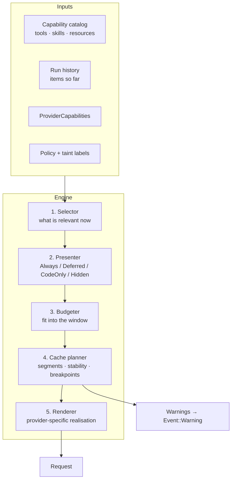
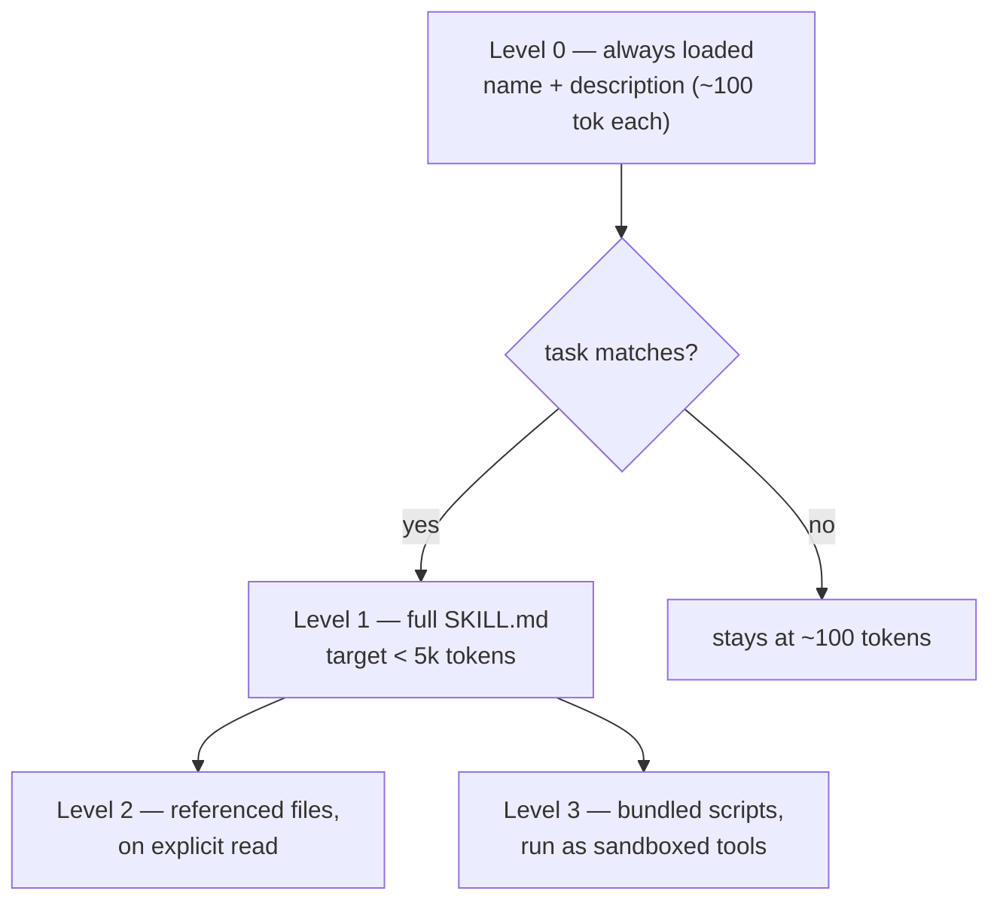
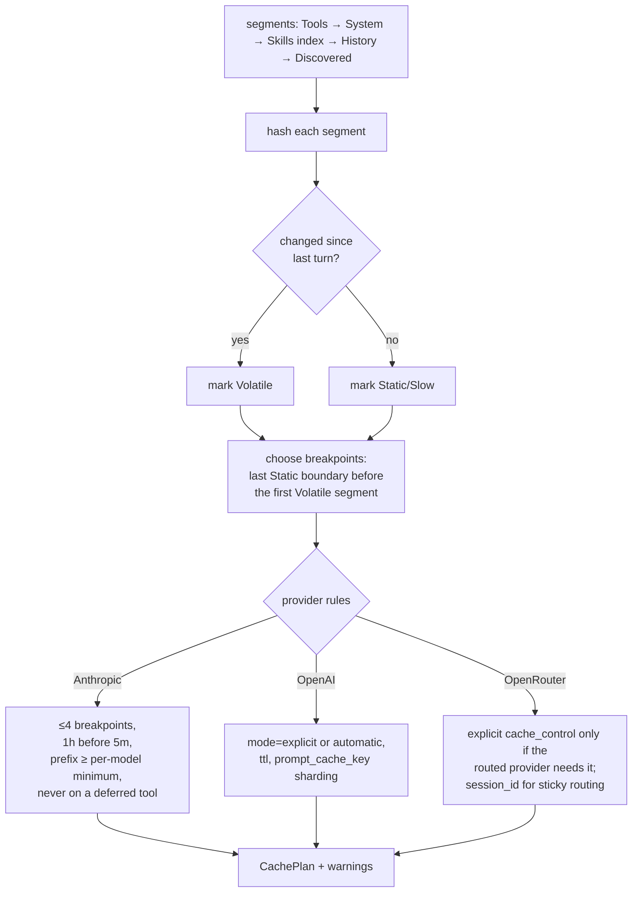
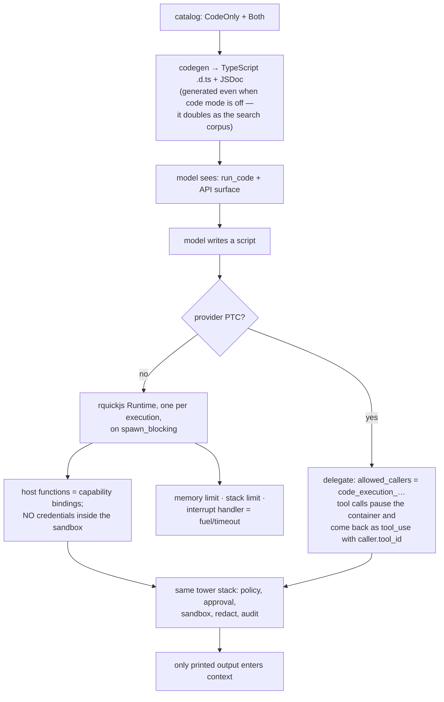

# Frey — Context Engine (`frey-context`)

*Draft 1, 2026-08-08. This is the crate the framework is named for, in spirit: the thing that
decides what the model sees, in what order, at what price.*

---

## 1. Responsibilities



Every stage is a **pure function** of its inputs. No I/O, no clock, no RNG. That is what makes the
whole engine unit-testable and replay-safe, and it is a deliberate contrast to frameworks where
prompt assembly is scattered through the loop.

---

## 2. Budget

```rust
pub struct ContextBudget {
    pub window: u32,                  // from ProviderCapabilities::max_context
    pub reserve_output: u32,          // never encroach
    pub reserve_headroom: u32,        // slack for discovery + tool results mid-turn
    pub floors: Floors,               // minimum guaranteed allocations
}

pub struct Floors {
    pub system: u32,
    pub recent_history: u32,          // last N turns are never evicted
    pub pinned_tools: u32,
    pub skill_index: u32,
}
```

Eviction order when over budget (each step emits a `Warning` so it is never silent):
1. drop `Deferred` tool *definitions* discovered earlier and unused since;
2. summarise the oldest history above `recent_history` (a summariser is a `Tool`, so it is
   budgeted, audited, and replayable like anything else);
3. elide large tool results, replacing them with a handle + byte count
   (`bytes_elided` on `ToolResultItem`, and the model is told how to fetch the rest);
4. demote `Always` tools to `Deferred` in reverse frequency order;
5. refuse the turn with a structured error naming what could not fit.

**Never** silently truncate. A framework that silently drops context produces bugs nobody can
diagnose, which is the whole reason this crate exists.

---

## 3. Presentation and the catalog

One catalog, four presentation modes, three sources:

```mermaid
flowchart LR
    subgraph Sources
        NT[Native #[frey::tool]]
        MT[MCP servers]
        SK[Skills · SKILL.md]
        SA[Sub-agents / A2A peers]
    end
    Sources --> C[(Capability catalog<br/>name · description · schema ·<br/>caps · cost hint · embeddings)]
    C --> P{Presenter}
    P --> A1["Always → stable prefix"]
    P --> D1["Deferred → index only"]
    P --> CO["CodeOnly → typed API surface"]
    P --> HI["Hidden → not this step"]
```

Sub-agents and A2A peers being *tools* is not a trick — it means delegation is budgeted,
approved, audited, and discoverable exactly like a file read.

### 3.1 The presenter's decision rule

```
score(capability) = w_pin·pinned + w_recent·used_recently + w_rel·relevance(task)
                  − w_cost·est_tokens − w_risk·destructive
```
Pinned and recently-used capabilities stay `Always` (Anthropic's own guidance: keep the 3–5
hottest non-deferred). Everything else defers. The weights live in config and are logged with the
plan, so "why did it not see the tool" is answerable from a trace instead of a guess.

---

## 4. Discovery

```rust
#[dynosaur::dynosaur(DynCapabilitySearch)]
pub trait CapabilitySearch: Send + Sync {
    async fn search(&self, q: &Query, cx: &StepCx) -> Result<Vec<CapabilityRef>, SearchError>;
    fn kind(&self) -> SearchKind;   // Regex | Bm25 | Embedding | ProviderNative
}
```

Shipped: `Regex` (mirrors Anthropic's `re.search`, case-insensitive, 200-char cap so behaviour
matches when we emulate), `Bm25` (in-process index, rebuilt on catalog change, 500-char queries),
`Embedding` (pluggable embedder, cosine over cached vectors).

**Delegation rule** (ADR-0008): if `ProviderCapabilities::tool_search == Native`, mark deferred
tools with the provider's own flag and let the server search. Otherwise run locally and inject
definitions **after the cache breakpoint**, which is exactly what Anthropic's API does internally
so the system-prompt prefix is untouched.

Two constraints we inherit and must encode:
- deferred tools are still **transmitted** every request (context saving, not bandwidth);
- a deferred tool **cannot** carry `cache_control` (400) — the planner must never try.

### 4.1 Making tools discoverable is a lint, not a hope

Search matches **names, descriptions, argument names, and argument descriptions**. So
`frey doctor` fails a tool that has: no description, undocumented parameters, a name outside its
namespace prefix, or a description under ~12 words. Discoverability is a *measurable property of
the catalog*, and we measure it.

---

## 5. Skills

Skills follow the open `agentskills.io` standard: a directory with `SKILL.md` plus optional
`scripts/`, `references/`, `assets/`.



The ladder is the *same* mechanism as deferred tools, so it shares the selector, the budgeter, and
the search index. One relevance model, one budget, one set of events.

**Skills are a trust boundary.** A `SKILL.md` is untrusted text and its `scripts/` are untrusted
code:
- pin by content digest; verify signatures where the source provides them;
- record provenance (`SourceId`) so an injected instruction can be traced to its file;
- skill *instructions* enter the prompt as `Tainted<_, LowIntegrity>` unless the skill directory
  is inside an operator-declared trusted root;
- bundled scripts run under the same sandbox and capability grants as any other tool — a skill
  cannot grant itself capabilities, it can only *request* them, and requests surface at install
  time, not at run time.

---

## 6. Cache planner

The concentrated form of research 02 §1–3. Inputs: segments + `ProviderCapabilities`. Output:
breakpoints + warnings. No I/O.



Warnings that must exist from day one:

| Warning | Trigger | Message shape |
|---|---|---|
| `ChurnDetected` | a segment marked Static changed hash | *"`system` changed between turns (a timestamp?). You are re-writing 12.4k cached tokens every turn ≈ $X/day at current volume."* |
| `BelowMinPrefix` | prefix < model minimum | *"Prefix is 380 tokens; `claude-opus-5` needs ≥512 to cache. Caching is silently doing nothing."* |
| `BreakpointOnVolatile` | planner forced onto a changing segment | names the segment and the last two hashes |
| `TooManyBreakpoints` | >4 on Anthropic, or 4 + automatic | says which one was dropped and why |
| `CacheKeyOverloaded` | OpenAI `prompt_cache_key` traffic > ~15 rpm | suggests a sharding dimension |
| `StickyRouteLost` | OpenRouter returned a different provider than last turn | warns that tokenizer, pricing and cache all just changed |

This table is the most user-visible thing in the framework. It should read like a good compiler
diagnostic: what happened, what it costs, what to do.

---

## 7. Code mode



Engine decision (ADR-0013, resolved): **`rquickjs` 0.12.2** by default —
`set_memory_limit`, `set_max_stack_size`, `set_interrupt_handler` (returns `true` to raise, giving
us fuel and wall-clock limits), `set_gc_threshold`, `execute_pending_job`. Its `Runtime`/`Context`
are mutex-guarded and unsuited to async, so we give **each execution its own `Runtime` on a
`spawn_blocking` thread** and bridge host calls to the async world over channels — which
coincidentally yields the fresh-isolate-per-run model Cloudflare uses. `deno_core`/V8 sits behind
an optional feature for users who want full TypeScript and npm-shaped ergonomics.

The script never gets network or filesystem access directly — only bindings. Expected effect from
the published numbers: Cloudflare −32% simple / −81% batch; Anthropic PTC +11% accuracy at −24%
input tokens. Frey should measure its own and publish the harness, not quote theirs.

---

## 8. Tests this crate must carry

| Tier | Test |
|---|---|
| unit | `CachePlanner::plan` is pure: same inputs ⇒ identical plan, 10k property-test cases |
| unit | every provider rule (breakpoint cap, TTL ordering, min prefix per model, no `cache_control` on deferred) has a failing-case test |
| unit | budgeter never exceeds `window − reserve_output`; eviction order is exactly as specified |
| golden | plan snapshots for a fixed catalog × 6 provider profiles |
| property | discovery: for a 500-tool synthetic catalog, `Regex`/`Bm25`/`Embedding` each retrieve the planted target in top-5 ≥ N% of queries |
| behavioural | churn detection fires on a system prompt containing a clock, and does **not** fire on a stable one |
| behavioural | skills ladder loads exactly level 0 until a matching task appears |
| integration | with a recorded Anthropic session: emulated discovery and native `defer_loading` produce the same tool set |
| cost | a fixture run asserts cache-read ratio > X and fails CI on regression (the framework's own claim, guarded) |
