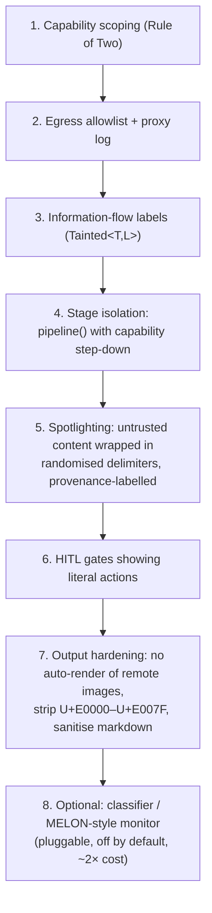

# Frey — Security Architecture (`frey-sandbox`, policy in `frey-tools`)

*Draft 1, 2026-08-08. Design goal: when a harness built on Frey is audited, the auditor's questions
have mechanical answers. Research basis: `notes/research/04-security-and-sandboxing.md`.*

---

## 1. The five questions an auditor asks, and where the answer comes from

| Question | Frey's answer |
|---|---|
| What can this agent reach? | The capability grant set — declared, static, printable via `frey caps` |
| What did it actually do? | The append-only audit log; one `SandboxReport` shape for every backend |
| Where does untrusted data become trusted? | `grep declassify` + the runtime declassification log (file:line, reason, authority) |
| What could it have exfiltrated? | The egress allowlist and the proxy log |
| What did the shell run? | `argv`, recorded verbatim — because Frey never builds a command string |

If any of those five answers requires reading the agent's source, the design has failed.

---

## 2. Capability model

```rust
#[non_exhaustive]
pub enum Capability {
    FsRead(PathScope), FsWrite(PathScope),
    NetEgress(HostPattern),      // concrete hostnames only — no wildcards, resolved once at start
    Exec(ProgramScope),
    Secret(SecretName),
    Spend(Budget),
    Mcp(ServerId, ToolPattern),
    Delegate(AgentId),
}
```

Invariants, each with a property test:
1. **No ambient authority.** A tool that did not declare a capability cannot obtain it at runtime.
2. **Monotonic narrowing.** `child.grants ⊆ parent.grants`, always.
3. **Secrets never materialise in a sandbox.** `Capability::Secret` authorises the *supervisor* to
   perform an authenticated call on the tool's behalf; the tool receives a handle.
   (Cloudflare Code Mode's binding model — the sandbox cannot leak a key it never held.)
4. **No wildcard egress.** Hostnames are concrete and resolved once at sandbox start, which is what
   kills DNS rebinding. Wildcards are rejected at config parse time, not at runtime.
5. **Every denial is an event**, delivered to the model as `ToolOutcome::Denied` *and* to the
   operator as an alert. A silent denial teaches the model nothing and hides an attack.

### 2.1 Rule of Two as a session invariant

```rust
pub struct SessionPowers { untrusted_input: bool, confidential_access: bool, mutating_egress: bool }
```
All three ⇒ `RuleOfTwoViolation`. Resolutions, in order of preference:
**fork a child that drops one power** → **require human escalation (recorded)** → **refuse**.
Default is escalation. The violation message names *which three things* combined and where each
came from, using `Provenance`.

---

## 3. Taint as types

```rust
pub struct Tainted<T, L: Label> { value: T, prov: Provenance, _l: PhantomData<L> }
```

Labels: `Trusted` (operator-authored), `ModelDerived`, `LowIntegrity` (tool output, fetched page,
MCP/skill description, peer-agent output), `Confidential`.

The only integrity-raising operation:

```rust
#[track_caller]
pub fn declassify(self, why: Declassification, auth: &Authority) -> T
```

Every call site is enumerable statically; every invocation is logged with caller location, reason,
and authority. `Declassification` variants: `HumanApproved(ApprovalId)`, `Parsed(ValidatorId)`,
`PolicyAllowed(RuleId)`, `OperatorAsserted(&'static str)`.

**The honest declassifier is a parser.** `Tainted<String, Low> → Result<Url, _>` raises integrity
legitimately because the parser, not the model, decided the shape. Frey ships validators for the
things agents actually pass around: `Url`, `WorkspacePath`, `Semver`, `Json<T: DeserializeOwned>`,
`ShellArgv`, `SqlIdentifier`.

### 3.1 Ergonomics escape hatch (ADR-0011 remains open until prototyped)

If `Tainted<T, L>` proves to poison signatures across the codebase, the fallback is: keep
`Provenance` and `declassify()` as runtime constructs (still enumerable, still logged), and drop the
phantom type parameter. Prototype on `fs_read`, `http_get`, and `shell` **before** it enters the
public API. The decision criterion: can a competent Rust developer write a new tool without ever
mentioning a label? If not, demote it.

---

## 4. Sandbox backends

```rust
pub trait SandboxBackend: Send + Sync {
    fn probe() -> Availability;                        // what this host can actually enforce
    fn spawn(&self, spec: &ExecSpec, policy: &SandboxPolicy) -> Result<Sandboxed, SandboxError>;
}

pub struct SandboxReport {
    pub backend: BackendId,
    pub enforced: EnforcedSet,      // what was ACTUALLY enforced, not what was requested
    pub degraded: Vec<Degradation>, // each with a reason
    pub fs_effects: Vec<FsEffect>,  // from the COW overlay
    pub egress_attempts: Vec<EgressAttempt>,  // allowed and denied
    pub limits_hit: Vec<LimitHit>,
    pub exit: ExitStatus,
}
```

**Fail-closed rule:** if `probe()` cannot enforce the requested policy, `spawn` returns an error
naming the missing control. There is no "best effort" mode without an explicit, per-run,
operator-set `--allow-degraded` that is recorded in every `SandboxReport` and printed at run start.

### 4.1 Linux

Primary (kernel ≥ 6.12, Landlock ABI 6): **Landlock** for FS scopes, TCP port restrictions, IPC
scope; **seccomp-bpf** for unconditional syscall denial; **seccomp user notification** with
`pidfd_getfd()` for TOCTOU-safe on-behalf operations (socket create/bind), `execve` argv inspection,
and resource accounting. Model: Sandlock (arXiv 2605.26298) — ~5 ms startup vs Docker's ~300 ms,
p99 within noise of bare metal.

**Verified caveat:** Landlock ABI level must be *detected at runtime*, not assumed. RHEL 9.6 is
still on 5.14; Landlock also requires `landlock` in the `lsm=` boot parameter even when compiled
in. `rust-landlock`'s best-effort compatibility is used, and the **achieved ABI level is recorded
in `SandboxReport.enforced`**. Fallback below 6.12: user namespaces + seccomp + `setrlimit`
(+ cgroup v2 where available), with the reduced guarantees listed explicitly as `Degradation`s.

Honest limits, to be documented not hidden: memory caps count requested address space rather than
resident pages; limits are enforced cooperatively via syscall interception; **network effects
cannot be rolled back** (filesystem effects can, via the COW overlay).

### 4.2 macOS

Seatbelt via `sandbox_init()` / SBPL profiles. Once applied the profile cannot be relaxed for the
process lifetime and is inherited by every child — exactly the semantics we want.
`sandbox-exec` is deprecated by Apple but functional, and it is what Claude Code, Codex, Gemini CLI
and OpenClaw all actually use. **Risk registered:** track `apple/containerization#737`; the macOS
backend sits behind the same trait so it can be swapped without touching callers.

### 4.3 Windows

Two modes, modelled on Codex CLI's Rust implementation (which is **not published to crates.io**, so
we implement against the `windows` crate rather than depending on it):
- **Elevated**: AppContainer profile with **zero capabilities**, capability SID provisioning,
  ACL management, network lockdown.
- **Unelevated**: low-integrity **restricted primary token** — works without admin.
- Both: **synthetic SIDs** placed in workspace ACLs and the restricted token to force extra
  access-check conditions; a **Job object** (kill-on-close, active-process limit, optional memory
  cap); child spawned **suspended**, assigned to the job, then resumed; process mitigation policies
  and handle allowlisting via `STARTUPINFOEX`.

### 4.4 WASM

`wasmtime` with **fuel metering + epoch interruption** for untrusted *plugin* code (capability
imports only, no WASI by default). Deterministic and platform-independent — which also makes it the
natural backend for **replayable** tool execution in tests.

### 4.5 Not in v1
microVMs. For multi-tenant adversarial workloads the Sandlock authors are right that a microVM is
the answer, and saying so is better than implying our process sandbox is one.

---

## 5. The secure shell tool

```rust
#[frey::tool(capabilities("exec", "fs:read", "fs:write"), cost_hint = "destructive")]
async fn shell(
    /// Program and arguments. NOT a shell command string.
    argv: ShellArgv,
    /// Working directory, must be inside the workspace.
    cwd: WorkspacePath,
) -> Result<Tainted<ShellOutput, LowIntegrity>, ToolError>
```

Rules:
1. **`argv`, never a command string.** If the user genuinely needs shell semantics, they opt into
   `shell_script`, which **parses** the script and allowlists by AST shape — never by regex.
   (Codex's PowerShell AST analysis is the precedent; regex denylists of `rm -rf` are defeated by
   `r''m`, `$(printf …)`, or base64 piping.)
2. **Empty environment by default**; variables added by name from policy. No inherited API keys.
3. **Explicit FS scopes** with a COW overlay over the workdir, so effects are reviewable and
   revertible and land in `SandboxReport.fs_effects`.
4. **Deny-all egress**, allowlist of concrete hostnames resolved once at sandbox start.
5. **Limits**: wall clock, CPU, memory, PID count, output bytes.
6. **Truncation is informative**: `bytes_elided` plus model-facing guidance on how to get the rest.
7. Output is `Tainted<_, LowIntegrity>` by construction.
8. `cost_hint = destructive` ⇒ `ApprovalLayer` requires approval by default, and the approval
   prompt shows **the literal argv**, never a natural-language summary.

---

## 6. Prompt-injection posture

Frey implements the deterministic layers and is honest about the probabilistic ones.



Layers 1–7 ship in v1. Layer 8 is a trait with no default implementation, because published
classifiers have 1.75–7.5% residual ASR and adaptive attacks beat all of them.

**The docs must state plainly what is unsolved:** prompt injection cannot be fully solved within
current LLM architectures; memory poisoning across sessions, response-based exfiltration (monitors
watch tool calls, not prose), and multi-agent privilege escalation remain open. Overclaiming here
is how a framework loses credibility with the exact audience it needs.

---

## 7. Secrets & supply chain

- `Secret<T>` wrapper: no `Debug`/`Display`/`Serialize`, `Zeroize` on drop, cannot be logged.
  Redaction is a **type property**, not a regex over log lines.
- MCP servers and skills are pinned by digest; signatures verified where offered; their
  `description` text is `LowIntegrity` before it reaches a prompt.
- CI: `cargo deny` (advisories, licences, bans, sources), `cargo audit`, `cargo vet` for
  first-party review of new dependencies.
- `#![forbid(unsafe_code)]` everywhere except `frey-sandbox`'s per-platform modules, which isolate
  `unsafe` in small files with their own review checklist and Miri-where-possible coverage.
- SBOM (CycloneDX) on release; reproducible builds documented.

---

## 8. Tests

| Tier | Test |
|---|---|
| property | no ambient authority: random tool + random missing capability ⇒ always `Denied` |
| property | grant monotonicity across random spawn trees |
| unit | every `declassify` variant writes an audit record with correct `#[track_caller]` location |
| unit | `Secret<T>` fails to compile if `Debug`-formatted (trybuild UI test) |
| escape | **red-team corpus**: `rm -rf` obfuscations, path traversal out of the workspace, symlink escapes, `/proc/self` tricks, DNS rebinding, env-var exfiltration, Unicode-tag smuggling — each must be *denied and reported*, per backend |
| behavioural | fail-closed: on a host with no usable backend, an `exec` tool errors and does **not** run |
| behavioural | degraded mode requires the explicit flag and stamps every `SandboxReport` |
| differential | the same policy on Linux/macOS/Windows produces the same `EnforcedSet` or an explicit `Degradation` |
| integration | injected instructions in a fetched page cannot cause an egress call to a non-allowlisted host (AgentDojo-style fixture) |
| regression | every published CVE-shaped bug we fix gains a permanent test |
