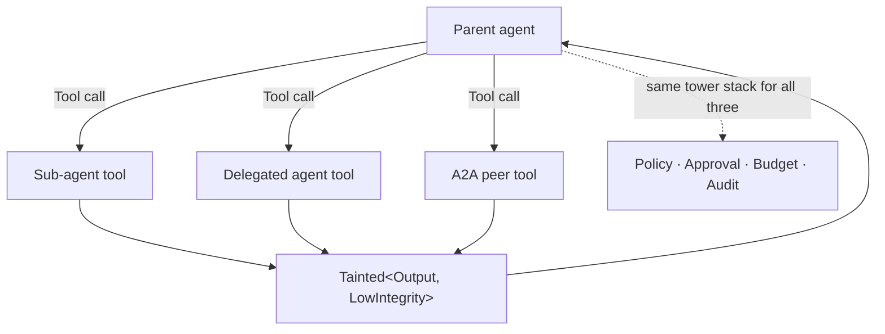
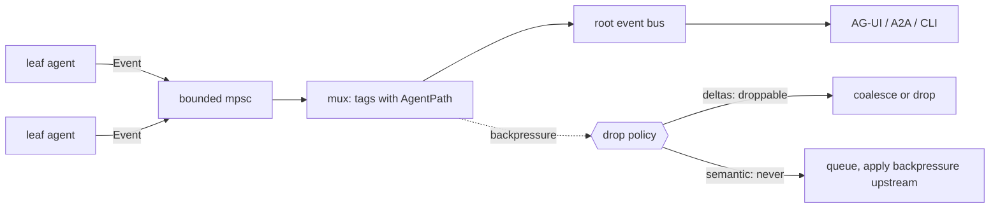

# Frey — Multi-Agent (`frey-agent`)

*Draft 1, 2026-08-08. In scope for v1 per ADR-0017. This document exists mostly to say **no** to
things: multi-agent is where frameworks go to become unfalsifiable.*

---

## 1. Three kinds of "another agent", deliberately distinguished

| Kind | What it is | Trust | Transport |
|---|---|---|---|
| **Sub-agent** | Another Frey `Agent` we constructed, in-process or in a task | our code, our policy | direct call |
| **Delegated agent** | An external vendor agent process (`claude`, `codex`) | its own auth/sandbox/loop | child process, `AgentProvider` |
| **Peer agent** | A remote A2A agent | someone else's model | A2A over HTTP |

All three appear in the catalog as **tools**, so they are budgeted, approved, audited, taint-labelled
and discoverable like a file read. All three produce `LowIntegrity` output. There is no "trusted
agent" tier, because there is no such thing: a peer's response is model output wearing a task
envelope, and TLS proves who said it, not whether it is true.



---

## 2. Context inheritance — the actual hard problem

The surveyed ecosystem gap is "no pattern for sharing large read-only state across concurrent
agents; the actor model forbids it." Frey's answer:

```rust
pub struct SharedContext(Arc<ContextSnapshot>);   // immutable, cheaply cloned
pub struct AgentSpawn {
    pub inherit: Inheritance,
    pub grants: Vec<Grant>,        // ⊆ parent's grants, never a superset
    pub budget: ContextBudget,     // carved out of the parent's remaining budget
}

pub enum Inheritance {
    None,                       // fresh context; the sub-agent gets only its task
    Summary,                    // parent supplies a written brief (default)
    Snapshot(SharedContext),    // full read-only share via Arc — no copy, no mailbox
}
```

`Arc<ContextSnapshot>` + `arc-swap` for hot-reloadable config beats an actor mailbox for
read-mostly data: no message copy, no serialisation, no supervisor round-trip. Use actors for
*control*, `Arc` for *context*. That is the whole answer to the gap and it is a five-line decision.

**Capability monotonicity is a hard invariant:** a child's grants are always a subset of its
parent's, enforced at spawn, tested by a property test that generates random grant trees. This is
the structural defence against multi-agent privilege escalation — the failure mode the injection
literature calls out as growing multiplicatively with pipeline depth.

**Rule of Two composes downward.** If the parent has already consumed untrusted input, a child
that gains a confidential capability *and* mutating egress trips the check at spawn time. The
canonical safe pattern — and one Frey should make one line — is the CaMeL shape:

```rust
let quarantined = agent.child(Inheritance::None)          // sees untrusted content
    .grants([])                                            // no tools at all
    .build()?;                                             // extract structure only
let privileged = agent.child(Inheritance::Summary)         // never sees raw untrusted text
    .grants([Capability::NetEgress(api_host)])
    .build()?;
```

---

## 3. Orchestration primitives (small, boring, composable)

Frey ships four and no more:

| Primitive | Semantics |
|---|---|
| `delegate(agent, task)` | one child, awaited, result folded back as a tool result |
| `fan_out(agents, tasks)` | N children concurrently, bounded by a semaphore, results collected |
| `pipeline(stages)` | each stage's output is the next's input, **with a taint/capability step-down per stage** |
| `race(agents, task)` | first acceptable result wins; the rest are cancelled |

No graph DSL, no supervisor tree, no "swarm". If a user wants a DAG they can write Rust control
flow, which is more legible to them *and* to a coding agent than a bespoke builder API. This is a
deliberate anti-feature: the surveys show the Rust space is crowded with orchestration and starved
of infrastructure.

`pipeline` is singled out because it is the *security* primitive: Sandlock's threat model and
CaMeL both work by composing stages with asymmetric confinement. Stage boundaries are where
capabilities drop and taint is declassified under review.

---

## 4. Streaming through the tree

The named gap: leaf tokens must reach the root without buffering at every layer.



- Every event carries an `AgentPath` (`root/researcher/fetcher`) so a UI can render nested
  progress without the framework prescribing a layout.
- **Drop policy is a property, not a heuristic**: `Event::is_droppable()` is `true` only for
  `TextDelta` / `ReasoningDelta`. Everything else applies backpressure upstream.
- Dropped deltas are **counted** and reported at run end, so "the UI looked laggy" is diagnosable.

---

## 5. Tracing across boundaries

The other named gap. One mechanism, three carriers:

| Boundary | Propagation |
|---|---|
| in-process sub-agent | `tracing` span parent, directly |
| child process (delegated agent) | `TRACEPARENT` env var (W3C) on spawn |
| MCP tool call | `_meta.traceparent` / `tracestate` / `baggage` — **spec-standardised in 2026-07-28** |
| A2A peer | `traceparent` HTTP header + `Task.metadata` |

Result: one waterfall from the root run through a sub-agent through an MCP server. The demo that
sells the framework is a screenshot of that trace.

---

## 6. Delegated agents (`AgentProvider`) in detail

```rust
pub struct DelegatedTask {
    pub prompt: String,
    pub workspace: PathBuf,
    pub allowed_tools: Option<Vec<String>>,   // pass-through where the vendor supports it
    pub timeout: Duration,
    pub budget: Option<Money>,                // advisory; we cannot meter their tokens
}
```

- Spawned as a child process with a **clean environment plus only the vendor's own auth vars**.
  Frey never reads, copies, or forwards a vendor subscription OAuth token (ADR-0004).
- stdout/stderr are parsed into `AgentEvent`s and re-emitted on our bus with an `AgentPath`, so a
  delegated Claude Code run streams into the same UI as everything else.
- Usage: whatever the vendor reports, recorded as `reported_cost` when present and `None` otherwise.
  We do **not** estimate someone else's agent's spend. The docs must say plainly: delegated agents
  are metered by the vendor, on the vendor's plan, and Frey's ledger will show a gap.
- The vendor's sandbox is theirs; Frey's `SandboxReport` for a delegated run records
  "external, not enforced by Frey" rather than pretending.

That honesty is the feature. A harness that claims to have sandboxed a process it did not sandbox
fails an audit the moment anyone checks.

---

## 7. Tests

| Tier | Test |
|---|---|
| property | for random spawn trees, child grants ⊆ parent grants, always (10k cases) |
| property | Rule of Two never satisfiable across a parent/child pair without a recorded escalation |
| unit | `Inheritance::Snapshot` performs zero deep copies (assert `Arc::strong_count`) |
| behavioural | leaf `TextDelta` reaches the root bus; under induced backpressure deltas drop and semantic events do not; drop count reported |
| behavioural | `race` cancels losers and their sandboxes are torn down (assert no orphan processes) |
| integration | trace assertion: root span is an ancestor of a span emitted by an MCP server in a separate process |
| integration | delegated `claude`/`codex` run streams events and terminates cleanly on timeout and on cancel |
| replay | a full multi-agent run replays deterministically from the journal, including interleaving order |
| security | a compromised sub-agent that emits injected instructions cannot cause the parent to exceed its own grants (adversarial fixture) |
