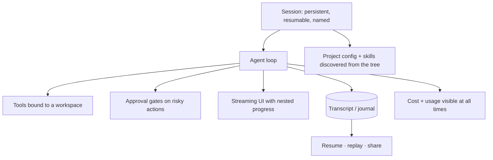

# Frey — Harness Layer (`frey-harness`, `frey-cli`)

*Draft 1, 2026-08-08. R4: 2026's popular shape is the **harness**, not the chatbot. This layer is
what makes "write a Claude-Code-like thing for my domain" a weekend, not a quarter.*

---

## 1. What a harness actually is

Strip the branding off Claude Code / Codex / Cursor and the common skeleton is:



None of that is model-specific, and all of it is what people rebuild badly every time. Frey ships
it as a library, so a harness author writes their *domain* and not their plumbing.

---

## 2. `Harness` — the top-level type

```rust
let harness = Harness::builder()
    .agent(agent)
    .workspace("./")                       // roots, gitignore-aware, defines FS scopes
    .session_store(SessionStore::sqlite("./.frey/sessions.db"))
    .approvals(ApprovalPolicy::interactive())   // or ::auto_allow(risk < Medium), ::deny_all()
    .surface(Surface::AgUi(bind("127.0.0.1:7777")))  // or ::Cli, ::A2a, ::Mcp, ::Headless
    .build()?;

harness.serve().await?;
```

`Surface` is the projection choice, and a harness may expose several at once — the same run
streaming to a terminal, an AG-UI frontend, and an A2A subscriber, because all three are
serialisations of one event bus (ADR-0015).

| Surface | Use |
|---|---|
| `Cli` | terminal harness with a TUI: nested progress by `AgentPath`, inline approvals, live cost |
| `AgUi` | HTTP event stream for a web/desktop frontend; shared state via JSON Patch |
| `A2a` | the harness *is* an A2A agent; serves `/.well-known/agent-card.json` |
| `Mcp` | the harness's toolset exposed as an MCP server (Streamable HTTP) |
| `Headless` | CI/cron: no interactivity, `ApprovalPolicy` must be non-interactive or it errors at build time |

That last constraint matters: a headless harness with an interactive approval policy is a hang
waiting to happen. Catch it in the builder, not at 3am.

---

## 3. Sessions

```rust
pub struct Session {
    pub id: SessionId,
    pub title: Option<String>,
    pub context_id: ContextId,     // == A2A contextId
    pub journal: JournalHandle,    // append-only, the source of truth
    pub powers: SessionPowers,     // Rule-of-Two tracking (research 04 §2)
    pub ledger: UsageLedger,
}
```

- **The journal is the session.** Resume replays it; there is no separate "session state" that can
  drift from the transcript. This is what makes `frey replay` and crash-resume the same mechanism.
- Sessions are **forkable**: `session.fork()` branches the journal, which gives free "try a
  different prompt from turn 7" without re-running turns 1–6 (they are cached and replayed).
- `SessionPowers` persists, so the Rule of Two survives a resume — an agent that saw untrusted
  input yesterday does not silently regain full powers today.

---

## 4. Approvals

The single most audited surface in any harness, so it gets explicit rules:

1. The prompt shows the **literal action** — argv, full URL, SQL text, file diff — never a
   natural-language summary. (Injection research, layer 8: summaries are exactly where attacks hide.)
2. Every approval decision is journalled with who, when, what, and the `Provenance` of the data
   that led to it.
3. `ApprovalPolicy` supports scoping: allow-once, allow-for-session, allow-for-pattern
   (e.g. `git status` always). Scoped grants are capabilities, so they narrow the same way and
   expire the same way.
4. `ApprovalPolicy::auto_allow(risk)` is available but the risk classification comes from
   `CostHint` + capability set, not from the model's opinion of its own action.
5. Denial is informative: the model receives `ToolOutcome::Denied` with guidance, so it can try a
   permitted route instead of looping.

---

## 5. `frey-cli`

```
frey init              scaffold a project: frey.toml, skills/, an example tool, CI workflow
frey run [task]        run once; --resume <session>; --replay <journal>
frey chat              interactive TUI harness
frey doctor            environment + project diagnosis  (see below)
frey tools             list the catalog: presentation mode, tokens, capabilities, discoverability score
frey caps              print the effective capability grant set for a config
frey cost              usage ledger for a session or a date range; --explain
frey replay <journal>  deterministic re-run; --diff to compare against the recorded outcome
frey mcp <server>      inspect an MCP server: protocol revision, tools, ttlMs, schema lint
frey a2a <url>         inspect a peer's agent card, verify its signature
frey record            wrap a live run and emit a redacted cassette for the test corpus
```

### `frey doctor` — the fastest path to a diagnosis

Checks, each with a one-line fix suggestion:
- sandbox: which backend is available, what it can enforce, Landlock ABI level actually achieved,
  whether `lsm=` includes landlock, whether Windows elevation changes the answer;
- providers: auth present, model reachable, capabilities detected vs configured;
- MCP servers: reachable, protocol revision, whether `tools/list` ordering is deterministic,
  whether `ttlMs` is sane, schema lint;
- context: estimated stable-prefix size vs the model's minimum cacheable prefix, predicted churn;
- catalog: tools with missing/short descriptions or undocumented parameters
  (**these are invisible to tool search** — it is a real defect, not a style nit);
- skills: unpinned digests, unsigned sources, capability requests;
- config: validates against the published JSON Schema.

`frey doctor --json` exists specifically so a coding agent can consume it. This is the highest-value
R13 feature in the whole framework: an agent that lands in an unfamiliar Frey project can orient in
one command instead of reading the source.

---

## 6. Terminal UI notes

- Nested progress keyed by `AgentPath`; sub-agent output collapses by default and expands on demand.
- Live cost and cache-hit-rate in the status line — because a number you can see is a number you
  optimise.
- Warnings (`ChurnDetected`, `StickyRouteLost`, `BelowMinPrefix`) surface inline, once, with the
  fix. They are compiler-diagnostic shaped: what happened, what it costs, what to do.
- `Ctrl-C` cancels the *turn* and tears down sandboxes; twice exits. Cancellation is a first-class
  path with its own tests (no orphan processes, ever).

---

## 7. Tests

| Tier | Test |
|---|---|
| behavioural | headless surface + interactive approval policy fails at **build** time, not run time |
| behavioural | approval prompt content contains the literal argv/URL; never a summary (assert on the rendered string) |
| behavioural | scoped approval (`allow-for-session`) expires with the session and is journalled |
| behavioural | denial reaches the model as `Denied` with guidance and does not loop |
| integration | session resume from journal reproduces identical state; fork replays the shared prefix without re-calling the provider |
| integration | one run streams to CLI + AG-UI + A2A simultaneously with consistent ordering |
| integration | `Ctrl-C` mid-tool-call leaves no orphan processes on any platform |
| snapshot | `frey doctor --json` output is schema-stable (it is an agent-facing API) |
| docs | every CLI command has `--help` text and an example in the docs, both tested |
