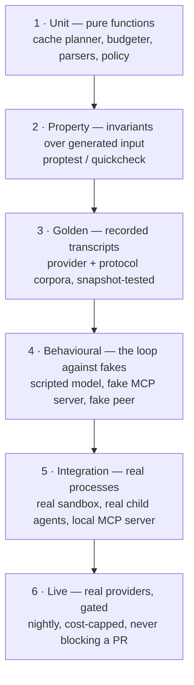

# Frey — Testing Strategy

*Draft 1, 2026-08-08. Per ADR-0018, every feature ships with tests. This document defines what
"tested" means so that requirement is enforceable rather than aspirational.*

---

## 1. Why this is architecture, not process

Two reasons it belongs in the architecture notes:

1. **The framework's claims are all empirical.** "Cuts context 85%", "cache hit rate stays high",
   "the sandbox denies X" are measurements. Untested, they are marketing.
2. **R13 — coding agents must be able to work in this repo.** An agent's only reliable feedback
   loop is `cargo test`. A framework with thin tests is a framework an agent will confidently
   break. Test density *is* agent-legibility.

The rule that keeps it honest: **every ADR names the test that would falsify it.**

---

## 2. Six tiers

Tiers 1–4 run on every PR and must complete in **under 60 seconds** on a laptop. Tier 5 runs on
every PR on the three platform runners. Tier 6 runs nightly with a hard spend cap and posts a
report; a tier-6 failure opens an issue, it does not block merges.

---

## 3. What each subsystem must prove

| Subsystem | The claim | The test that would falsify it |
|---|---|---|
| **Item model** (ADR-0003) | normalisation is lossless | round-trip `raw → Vec<Item> → raw` byte-identical over the recorded corpus, per provider |
| **Cache planner** (ADR-0007) | provider rules are never violated | property test over generated catalogs × 6 provider profiles: ≤4 breakpoints, 1h before 5m, prefix ≥ model minimum, never on a deferred tool |
| **Cache planner** | churn is detected | fixture with a clock in the system prompt fires `ChurnDetected`; a stable prompt does not |
| **Budgeter** | never overruns | property: for random catalogs and histories, rendered tokens ≤ `window − reserve_output` |
| **Discovery** (ADR-0008) | emulation ≡ native | with a recorded Anthropic session, local search and `defer_loading` yield the same tool set for the same query |
| **Discovery** | scales | 500-tool synthetic catalog: planted target in top-5 for ≥ N% of paraphrased queries, per search kind |
| **Tool tower** (ADR-0005) | layers compose in the specified order | trace assertion on layer entry/exit ordering; each layer has an isolated unit test |
| **Errors** (ADR-0009) | audiences never leak into each other | property: `Diagnostic` text never appears in any `ModelMessage`; secrets never appear in either |
| **Errors** | fatal is fatal | injected 401/402/403 never triggers a retry, always surfaces |
| **NeedsInput** (ADR-0010, 0017) | one type, four projections | the same `InputRequests` projects into MCP / A2A / AG-UI / CLI and resumes identically from each |
| **MCP** (ADR-0001/0002) | negotiation converges | 2026-07-28 server, 2025-11-25 server, and a `server/discover`-404 server all produce the same internal catalog |
| **A2A** (ADR-0017) | lifecycle + fan-out are spec-correct | all 8 states reachable; terminal ends the stream; N subscribers see identical ordered events; closing one doesn't disturb others |
| **Sandbox** (ADR-0011/0012) | it actually denies | per-backend red-team corpus (traversal, symlink escape, DNS rebinding, env exfiltration, obfuscated `rm -rf`) — each denied **and** reported |
| **Sandbox** | fail-closed | on a host with no usable backend, `exec` errors and does not run |
| **Capabilities** | no ambient authority, monotonic narrowing | two property tests over random tools and random spawn trees |
| **Taint** | declassification is enumerable | every `declassify` call site is covered; each writes an audit record with the right caller location |
| **Journal / replay** (ADR-0014) | replay is deterministic | record 50 real runs; replay each 100× ⇒ identical item sequences; a deliberately mutated prompt diverges at the exact expected step |
| **Multi-agent** | streaming survives depth | leaf `TextDelta` reaches the root; under backpressure deltas drop, semantic events never do; drop count reported |
| **Tracing** | spans cross processes | root span is an ancestor of a span emitted by an MCP server in a separate process |
| **Usage ledger** | we never invent money | property: `reported_cost` is `None` unless the provider sent one; estimates are always labelled |
| **Code mode** (ADR-0013) | limits hold | runaway loop hits the interrupt handler; allocation bomb hits the memory limit; no filesystem or network reachable from the script |
| **Config** | agent-authorable | every example `frey.toml` validates against the published JSON Schema; every schema field has a description |
| **Docs** | examples compile | all README and doc examples are doctests or `examples/` targets built in CI |

---

## 4. Test infrastructure to build first

These are load-bearing and should exist before the features they test.

1. **`frey-testkit`** (dev-dependency crate):
   - `ScriptedModel` — a `ModelProvider` driven by a list of scripted responses, with assertions on
     what it *received* (tool block contents, cache marks, item order). Most behavioural tests use it.
   - `FakeMcpServer` — configurable to any protocol revision, including hostile behaviour
     (bad ordering, lying `ttlMs`, oversized results, injected instructions in descriptions).
   - `FakePeer` — an A2A agent that can be told to enter any of the 8 states.
   - `RecordingProvider` — wraps a real provider and writes a cassette (tier 6 → tier 3 pipeline).
2. **Cassette corpus** (`tests/corpora/`): recorded, **redacted** real traffic per provider,
   committed to the repo. This is what makes tier-3 tests possible without spending money, and it
   is how provider drift gets caught (re-record nightly; a diff is a signal, not a failure).
3. **Deterministic simulation harness**: seeded scheduler + simulated clock + injectable failures,
   so the loop can be run 10,000 times with different interleavings. This is how "no flakes" becomes
   a claim rather than a hope.
4. **Red-team corpus** (`tests/redteam/`): injection payloads, sandbox escapes, malicious
   `SKILL.md`s, hostile MCP descriptions. Each entry is a file with an expected outcome. Growing it
   is a standing invitation for contributors and a good first issue.
5. **Cost/efficiency benchmarks** (`benches/`): cache hit rate, tokens per task, tool-selection
   accuracy at 10 / 100 / 1,000 tools. Tracked over time; a regression fails CI. These are the
   numbers the README quotes, so they must be reproducible by anyone who clones the repo —
   we publish our own measurements and the harness, never other projects' numbers as if they were ours.

---

## 5. Conventions

- Test names read as sentences: `cache_planner_refuses_breakpoint_on_volatile_segment`.
- One assertion concept per test; helpers do setup, never assertions.
- Every bug fix adds a regression test **in the same commit** — enforced by review, not CI heuristics.
- `#[should_panic]` is banned; use `Result`-returning tests and assert on the error variant.
- Snapshot tests use `insta` with reviewed, committed snapshots; unreviewed snapshot churn fails CI.
- Any test needing network is tier 6 and is `#[ignore]`d by default with a documented feature flag.
- Coverage is measured (`cargo llvm-cov`) and reported, but **no coverage gate** — gates produce
  tests that exercise lines without asserting behaviour, which is worse than no test at all.

---

## 6. CI matrix

| Job | Platforms | Runs |
|---|---|---|
| `check` (fmt, clippy `-D warnings`, `cargo deny`, `cargo audit`) | linux | every PR |
| `test` (tiers 1–4) | linux, macos, windows | every PR |
| `test-integration` (tier 5, real sandboxes) | linux (6.12+ and an older-kernel runner), macos, windows elevated + unelevated | every PR |
| `msrv` | linux | every PR |
| `docs` (doctests, examples build, schema validation, mermaid render check) | linux | every PR |
| `live` (tier 6, cost-capped) | linux | nightly |
| `bench` | linux | nightly, tracked |
| `redteam` | all three | every PR |

The older-kernel runner is not optional: the whole Landlock story depends on graceful, *reported*
degradation, and that path is only exercised on a host that lacks ABI 6.
