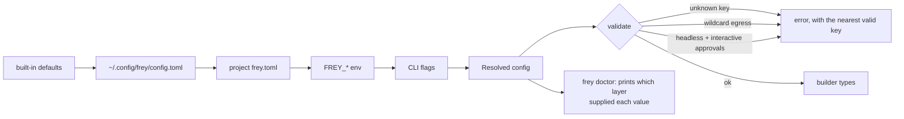

# Frey — Configuration (`frey.toml`)

*Draft 1, 2026-08-08. Two audiences: a human skimming, and a coding agent authoring it correctly
on the first try (R13). The second audience is why the schema is published.*

---

## 1. Principles

1. **Everything configurable is also constructible in Rust**, and the Rust API is the source of
   truth. Config deserialises into the same builder types — no parallel implementation.
2. **The JSON Schema is a build artifact** (`frey.schema.json`, generated by `schemars` from the
   config types) and is published with every release. Editors validate; agents author correctly.
3. **No magic env fallbacks.** Secrets are referenced by name (`env = "OPENAI_API_KEY"`), never
   silently picked up. What is used is printable via `frey caps`.
4. **Unknown keys are an error, not a warning.** A typo'd security setting that silently does
   nothing is a vulnerability.
5. **Layering** is explicit and inspectable: defaults → `~/.config/frey/config.toml` → project
   `frey.toml` → env → CLI flags. `frey doctor` prints which layer supplied each value.

---

## 2. Worked example

```toml
schema = "https://frey.rs/schema/0.1/frey.schema.json"

[agent]
model  = "anthropic:claude-opus-5"
system = { file = "prompts/system.md" }       # file, so it is a stable cache segment
max_turns = 40

# ---------- providers ----------
[provider.anthropic]
auth = { kind = "header", name = "x-api-key", env = "ANTHROPIC_API_KEY" }

[provider.openrouter]
auth       = { kind = "bearer", env = "OPENROUTER_API_KEY" }
session_id = "auto"        # sticky routing; "auto" derives a stable id per Frey session

# A provider defined entirely in config — no Rust required (R3)
[provider.internal-vllm]
dialect  = "openai_chat"                     # openai_responses | openai_chat | anthropic_messages
base_url = "https://llm.internal/v1"
auth     = { kind = "bearer", env = "VLLM_KEY" }

[provider.internal-vllm.capabilities]        # overrides the dialect defaults; no lying
cache               = "none"
strict_schema       = "none"
parallel_tool_calls = false
max_context         = 128000
modalities          = ["text"]

[provider.internal-vllm.pricing]             # estimates only; reported_cost stays None
input  = 0.0
output = 0.0

# Delegating to a vendor agent process. Frey never touches its credentials.
[agent_provider.claude-code]
kind    = "claude"                            # claude | codex
command = "claude"                            # resolved on PATH; auth stays inside that process
timeout = "20m"

# ---------- context ----------
[context]
budget            = "auto"     # or an explicit token count
reserve_output    = 8192
always_tools      = ["fs_read", "fs_list", "shell"]   # the 3–5 hottest stay non-deferred
defer_threshold   = 10          # start deferring past this many tools
search            = "bm25"      # regex | bm25 | embedding | provider-native
summarise_after   = "70%"       # of budget

[context.cache]
strategy = "auto"               # planner picks breakpoints
ttl      = "short"              # short | long | mixed
warn_on  = ["churn", "below_min_prefix", "sticky_route_lost", "cache_key_overloaded"]

[context.code_mode]
enabled = true
engine  = "quickjs"             # quickjs | v8 | provider-native | off
limits  = { memory = "128MB", wall = "30s", stack = "1MB" }

# ---------- tools ----------
[[mcp]]
name      = "github"
transport = { kind = "http", url = "https://mcp.github.com" }
auth      = { kind = "oauth", issuer = "https://github.com" }
defer     = true                # whole server deferred; discovered on demand
pin       = "sha256:…"          # supply-chain pin
[mcp.cache]
respect_ttl = true
max_ttl     = "1h"              # cap a lying server

[[mcp]]
name      = "local-db"
transport = { kind = "stdio", command = "db-mcp", args = ["--readonly"] }

[skills]
dirs    = ["./skills", "~/.frey/skills"]
trusted = ["./skills"]          # outside this list, skill text is LowIntegrity
require_signature = false

# ---------- security ----------
[security]
rule_of_two = "escalate"        # escalate | fork | refuse
allow_degraded_sandbox = false  # true must be set deliberately; stamped on every SandboxReport

[security.sandbox]
backend   = "auto"              # auto | landlock | seatbelt | windows | wasm | none
workspace = "./"
fs_read   = ["./", "~/.cargo/registry"]
fs_write  = ["./target", "./out"]
exec      = ["cargo", "git", "rg"]
egress    = ["api.github.com", "crates.io"]   # concrete hosts only; wildcards rejected at parse
limits    = { wall = "120s", memory = "2GB", pids = 64, output = "4MB" }

[security.approvals]
policy       = "interactive"    # interactive | auto_allow | deny_all
auto_allow_below = "medium"     # risk from CostHint + capabilities, never the model's self-report
always_ask   = ["shell", "http_post", "git_push"]

# ---------- observability ----------
[observability]
log_level = "info"
otel      = { endpoint = "http://localhost:4317", protocol = "grpc" }
journal   = { path = "./.frey/journal", retain = "30d", redact = true }

[cost]
budget_per_run     = "1.00 USD"     # hard stop, not a warning
warn_at            = "0.50 USD"
fail_on_unmetered  = false          # true = refuse providers that don't report cost
```

---

## 3. Resolution & validation



Validation errors follow the same audience discipline as everything else: they say what is wrong,
where it came from, and what to write instead. `unknown key "egres"` should suggest `egress`.

---

## 4. Tests

| Tier | Test |
|---|---|
| unit | every example in the docs round-trips: `toml → Config → toml` semantically equal |
| unit | unknown keys error, with a suggestion; wildcard egress errors; headless+interactive errors |
| golden | `frey.schema.json` is snapshot-tested — a schema change must be deliberate |
| property | layering: for random layer stacks, the resolved value always comes from the highest-precedence layer that set it |
| docs | every field in the schema has a `description`; CI fails on an undescribed field (this is what makes it agent-authorable) |
| integration | an agent-authored config (generated by an LLM from the schema alone) parses and runs — a standing R13 regression test |
