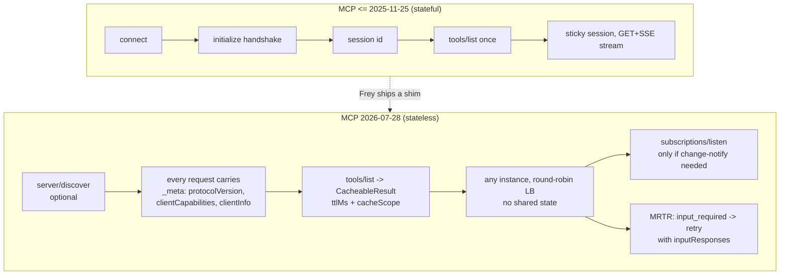

# Research 01 — Protocol & Platform Layer

*Gathered 2026-08-08. Sources at bottom. Every claim here should be re-verified before it becomes code.*

---

## 1. MCP `2026-07-28` — the spec Frey must be born on

This is the single most important finding of the research phase. The current MCP revision
(**2026-07-28**, superseding 2025-11-25) **removes the stateful core of the protocol**. Any
framework designed against the 2025 mental model is already legacy.

### 1.1 What was removed

| Removed | Replacement |
|---|---|
| `initialize` / `notifications/initialized` handshake | per-request `_meta` fields |
| `Mcp-Session-Id` header, protocol sessions | server-minted **handles** passed as ordinary tool args |
| HTTP `GET` endpoint + `resources/subscribe`/`unsubscribe` | `subscriptions/listen` (one long-lived POST-response stream) |
| `ping`, `logging/setLevel`, `notifications/roots/list_changed` | per-request `io.modelcontextprotocol/logLevel` in `_meta` |
| SSE resumability (`Last-Event-ID`, event IDs) | none — broken stream ⇒ client re-issues with a **new request id** |
| Server-initiated requests (`roots/list`, `sampling/createMessage`, `elicitation/create`) | **MRTR** (below) |
| `notifications/elicitation/complete`, `elicitationId` | MRTR retry + server-encoded `requestState` |

### 1.2 What was added

- **`server/discover`** — servers **MUST** implement. Advertises supported protocol versions,
  capabilities, identity. Clients **MAY** call before anything else, or use it as a
  back-compat probe on STDIO.
- **`_meta` well-known keys** (namespaced `io.modelcontextprotocol/…`):
  - `protocolVersion` (required per request)
  - `clientCapabilities` (required per request)
  - `clientInfo` (client SHOULD send per request)
  - `serverInfo` (server SHOULD send in each result's `_meta`)
  - `logLevel` (per-request; servers **MUST NOT** emit `notifications/message` without it)
  - `subscriptionId` (tags notifications on the `subscriptions/listen` stream)
  - **OpenTelemetry**: `traceparent`, `tracestate`, `baggage` — *standardised trace propagation*
- **`resultType`** on every result: `"complete"` | `"input_required"`.
  Results from older servers that omit it **MUST** be treated as `"complete"`.
- **MRTR (Multi Round-Trip Requests)** — server returns `InputRequiredResult`
  (`resultType: "input_required"`) with an `inputRequests` field; client retries the *original*
  request with `inputResponses` attached. This is how sampling/elicitation/roots-style
  interaction works now, without the server ever initiating a request.
- **`CacheableResult`** — `tools/list`, `prompts/list`, `resources/list`, `resources/read`,
  `resources/templates/list` now **require** `ttlMs` (freshness hint, ms) and
  `cacheScope` (`"public"` | `"private"`).
- **Header-based routing** — `Mcp-Method` and `Mcp-Name` are **required** headers on
  Streamable HTTP POSTs, so gateways/WAFs/rate limiters route and meter without parsing bodies.
  Plus `x-mcp-header` for custom headers derived from tool parameters.
- **Extensions framework** — `extensions` field on `ClientCapabilities`/`ServerCapabilities`.
  Tasks moved out of core into official extension `io.modelcontextprotocol/tasks`
  (polling via `tasks/get`, client→server input via `tasks/update`, no `tasks/list`).
- **Error code allocation policy** — `-32000..-32019` implementation-defined (grandfathered),
  `-32020..-32099` reserved for the spec. Renumbered: `HeaderMismatch` → `-32020`,
  `MissingRequiredClientCapability` → `-32021`, `UnsupportedProtocolVersion` → `-32022`.
  Resource-not-found moved `-32002` → `-32602`.
- **Schema loosening** — `inputSchema`/`outputSchema` accept **any JSON Schema 2020-12**
  keywords; `structuredContent` accepts any JSON value; `$ref` resolution requirements and
  composition-keyword resource bounds are specified.
- **Deterministic `tools/list` ordering** is a SHOULD — explicitly *"to improve LLM prompt
  cache hit rates"*. The spec itself now cares about prompt caching.

### 1.3 What was deprecated (12-month window, feature lifecycle policy)

- **Roots**, **Sampling**, **Logging** — suggested migrations: pass paths via tool params /
  resource URIs / server config; integrate LLM APIs directly instead of sampling; log to
  stderr or OTel instead of the logging feature.
- HTTP+SSE transport (reclassified Deprecated).
- OAuth 2.0 **Dynamic Client Registration** → **Client ID Metadata Documents (CIMD)**.
- `includeContext` values `"thisServer"` / `"allServers"`.

### 1.4 Authorization hardening

- RFC 9207 `iss` in authorization responses; clients **MUST** validate against recorded issuer.
- Clients **MUST** specify `application_type` in DCR (OIDC redirect-URI conflicts).
- Credentials **MUST** be keyed by issuer id, **MUST NOT** be reused across authorization
  servers, and clients **MUST** re-register when the AS changes.

### 1.5 Consequences for Frey

Design implications, concretely:

1. **The MCP client is a cache, not a session.** Frey's client should be a
   `tower`-style stack over HTTP with a **tool-catalog cache keyed by (server, ttlMs, cacheScope)**.
   Statelessness means we can prefetch, share catalogs across agents, and persist them to disk.
2. **`ttlMs` + deterministic ordering ⇒ we can make the tool block a stable prompt-cache prefix.**
   This is a *direct* lever on R7 (token efficiency). Frey should hash the serialized tool block
   and warn loudly when it churns.
3. **MRTR is a first-class control-flow shape**, not an edge case. `input_required` must map to a
   Rust type that the agent loop understands: "server needs a human/model decision, here are the
   requests, retry me". This composes beautifully with a permission/approval system (R10).
4. **Sampling is deprecated** — so the "MCP server asks the client to run an LLM call" pattern is
   dying. Frey should *not* build on it; instead, MCP servers should be given a Frey-native
   escape hatch and we integrate LLM providers directly.
5. **OTel `traceparent` in `_meta` is standardised** ⇒ Frey gets end-to-end distributed tracing
   across the agent → tool → MCP-server boundary *for free* if we adopt `tracing-opentelemetry`.
   That is a genuine differentiator vs. every framework that logs to stdout.
6. **Back-compat is mandatory** — the world is full of 2025-11-25 servers. Frey needs a
   negotiation shim: probe `server/discover`, fall back to `initialize`, and normalise both into
   one internal model.

---

## 2. Rust MCP SDK (`rmcp`) — build on it or beside it?

- `modelcontextprotocol/rust-sdk` is the **official** SDK; crate `rmcp`, macro crate `rmcp-macros`.
- Version observed: **3.1.1** on docs.rs; ~4.7M downloads on crates.io as of early 2026.
- Claims support for the stable **2026-07-28** spec while remaining compatible with 2025-11-25
  and earlier. The MCP blog describes Rust as a **beta-tier** SDK (Tier 1 = TS, Python, Go, C#).
- Features: tokio runtime, client + server, tool macros, resources, prompts, sampling, roots,
  logging, completions, notifications, Streamable HTTP, child-process transport, OAuth.

**Open question (verify in code):** does `rmcp` model `resultType`, MRTR, `CacheableResult`,
and `server/discover` as first-class types yet? Beta tier + a July spec suggests partial.
→ TODO: clone the repo, read `crates/rmcp/src`, check the changelog. **Do not assume.**

Frey's likely stance: **depend on `rmcp` for the wire protocol**, but define our own
`ToolCatalog`/`ToolHandle` domain types so we are not coupled to SDK churn, and so
native tools and MCP tools are indistinguishable to the agent loop.

---

## 3. Anthropic advanced tool use — the two features that define R6/R7

### 3.1 Tool Search Tool (GA on the Claude API)

Two server-side variants:
- `tool_search_tool_regex_20251119` — Claude writes **Python `re.search()` patterns**,
  case-insensitive, **max 200 chars**.
- `tool_search_tool_bm25_20251119` — natural-language queries, **max 500 chars**.

Mechanics:
- You still **send every tool definition on every request**. `defer_loading: true` controls
  what enters the **context window**, not what is transmitted.
- At least one tool must be non-deferred (normally the search tool itself) or you get a 400.
- Search covers **tool names, descriptions, argument names, and argument descriptions**.
- Returns `tool_reference` blocks (**up to 5 per search by default**), which the API expands
  into full definitions inline in the conversation.
- **Prompt caching is preserved**: deferred tools are excluded from the system-prompt prefix,
  and discovered definitions are appended *inline in the conversation*, so the prefix is untouched.
- A deferred tool **cannot** carry `cache_control` (400). Breakpoint goes on a non-deferred tool.
- Strict mode composes: the grammar builds from the full toolset, no recompilation.
- **Limits**: 10,000 deferred tools per request; 5 results/search.
- Reported effect: ~55k tokens of definitions for a 5-server setup → **>85% reduction**;
  selection accuracy degrades past **30–50 tools** without it.
- **Custom client-side search is supported**: any tool may return
  `{"type":"tool_result", "content":[{"type":"tool_reference","tool_name":"…"}]}` and the API
  expands it. This is the hook Frey needs — we can implement **embedding-based tool search**
  and still use Anthropic's expansion machinery.
- MCP connector integration: `defer_loading` is set on the `mcp_toolset`'s `default_config`
  (whole server) or per tool in `configs` — not per tool definition.

### 3.2 Programmatic Tool Calling (PTC) — Anthropic's Code Mode

- Requires the code execution tool (`code_execution_20260120` or later).
- Tools opt in via **`allowed_callers`**: `["direct"]` (default) | `["code_execution_20260120"]`
  | both. *Explicitly not a security boundary* — the docs say clients must still handle a
  direct `tool_use` for any defined tool.
- Flow: Claude writes Python → runs in sandboxed container → calling a tool **pauses** execution
  and the API returns a `tool_use` block with `caller: {type: "code_execution_20260120",
  tool_id: "srvtoolu_…"}` → you return the `tool_result` → execution resumes.
  **Intermediate results never enter the context window.**
- Tools appear to the model's code as **async Python functions taking one dict, returning a
  string** (the `tool_result` text). Claude can `asyncio.gather` them.
- Container: created per request unless reused; `container.id` + `expires_at`; idle reclaim
  ~5 min; max reuse 30 days. **While a programmatic call is pending, the container id is
  required on the follow-up request.** Pending call times out ~4 min → `TimeoutError` in the code.
- Message-format restriction: the user message carrying a programmatic `tool_result` may
  contain **only** `tool_result` blocks.
- Measured: +11% on BrowseComp/DeepSearchQA with **−24% input tokens**.

**Frey implication:** PTC is the *provider-native* form of code mode. Frey must model
"who is allowed to call this tool" (`Caller`) natively, because it maps 1:1 to `allowed_callers`
**and** to Frey's own sandboxed code-mode runtime for providers that lack PTC. And because
Anthropic says it is not a security boundary, **Frey's caller policy must be enforced
client-side** — that is a real, statable security feature.

---

## 4. Cloudflare Code Mode — the general pattern

- Premise: *"LLMs have seen a lot of code. They have not seen a lot of tool calls."*
  Tool-calling data is largely synthetic; code is millions of real repos.
- Mechanism: convert MCP schemas → **TypeScript API + JSDoc**, hand the model one
  `execute_code` tool, run the code in a **V8 isolate** (ms startup, few MB) with
  **no network**, results via `console.log`.
- **Bindings, not credentials**: the isolate gets a live object; all calls go to the agent
  supervisor which holds the tokens. The sandbox *cannot* leak an API key because it never has one.
- Reported: **−32% tokens** on simple tasks, **−81%** on complex batch operations.
  ("entire API in 1,000 tokens")
- Cloudflare shipped this into MCP server *portals* (2026-03-26 changelog).

**The two insights worth stealing wholesale:**
1. **Typed API surface > tool list.** Generate a real, documented API in a language the model
   writes fluently. (For Frey: TypeScript remains the best-known target; but a Rust-hosted
   sandbox running JS/TS or Python is an implementation choice, see research 04/05.)
2. **Capability bindings > secrets in the sandbox.** This is the security architecture Frey
   should adopt for *all* tools, not just code mode. A tool never receives a credential;
   it receives a handle that the supervisor resolves.

---

## 5. Agent Skills

- SKILL.md originated at Anthropic (Oct 2025), published as an **open standard at
  `agentskills.io`** on 2025-12-18.
- Shape: a directory with `SKILL.md` plus optional `scripts/`, `references/`, `assets/`,
  and routing metadata.
- **Progressive disclosure ladder**:
  1. startup: only `name` + `description` (~100 tokens each)
  2. on match: full `SKILL.md` (spec recommends **< 5,000 tokens**)
  3. on demand: referenced files, bundled scripts
- Adoption as of June 2026: ~40 skills-compatible products on the official showcase
  (Codex, Copilot, Cursor, Gemini CLI, VS Code, …).
- **Security literature already exists**: *"Under the Hood of SKILL.md: Semantic Supply-chain
  Attacks on AI Agent Skill Registry"* (arXiv 2605.11418) — skills are an untrusted-input
  supply chain. Also *SkillJuror* (2606.11543) on how skill organisation changes runtime behavior.

**Frey implication:** skills and tool-search are *the same mechanism at different altitudes*
— progressive disclosure over a catalog of capabilities. Frey should have **one** discovery
subsystem with two catalogs (tools, skills), one relevance model, one budget. And skill loading
must be a **trust boundary** with signing/pinning, because the attack literature is already
published. See research 04.

---

## 6. The unifying observation

Four independent efforts — MCP's `defer_loading`-friendly cacheable lists, Anthropic's tool
search, Cloudflare's code mode, and the Skills progressive-disclosure ladder — are all solving
**one** problem:

> The context window is a scarce, cache-sensitive, ordered resource, and naive frameworks
> spend it eagerly at startup on capabilities that will never be used.

No Rust framework treats this as its central abstraction. **That is the wedge candidate.**
It must be adversarially tested in research 03 before it goes in the README.

---

## Sources

- [MCP 2026-07-28 changelog](https://modelcontextprotocol.io/specification/2026-07-28/changelog)
- [MCP blog: The 2026-07-28 Specification](https://blog.modelcontextprotocol.io/posts/2026-07-28/)
- [modelcontextprotocol/rust-sdk](https://github.com/modelcontextprotocol/rust-sdk) · [rmcp on crates.io](https://crates.io/crates/rmcp) · [docs.rs/rmcp](https://docs.rs/rmcp)
- [Anthropic: Tool search tool](https://platform.claude.com/docs/en/agents-and-tools/tool-use/tool-search-tool)
- [Anthropic: Programmatic tool calling](https://platform.claude.com/docs/en/agents-and-tools/tool-use/programmatic-tool-calling)
- [Cloudflare: Code Mode](https://blog.cloudflare.com/code-mode/) · [Code Mode for MCP portals](https://developers.cloudflare.com/changelog/post/2026-03-26-mcp-portal-code-mode/) · [Cloudflare Agents: Code Mode docs](https://developers.cloudflare.com/agents/tools/codemode/)
- [Agent Skills ecosystem report 2026](https://agentman.ai/blog/agent-skills-ecosystem-report-2026) · [arXiv 2605.11418 — SKILL.md supply-chain attacks](https://arxiv.org/pdf/2605.11418) · [arXiv 2606.11543 — SkillJuror](https://arxiv.org/pdf/2606.11543)
