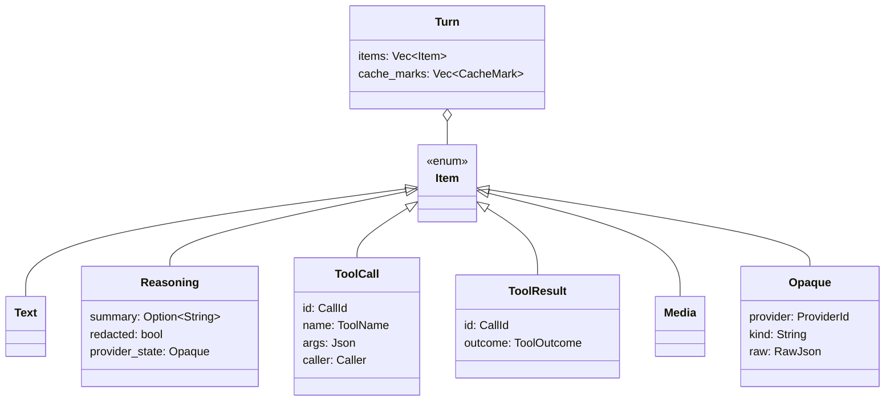
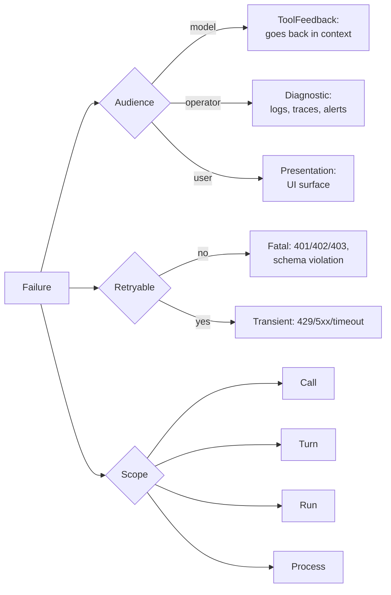

# Research 02 — Provider Nuance Matrix

*Gathered 2026-08-08. This note exists because "just abstract over providers" is where every
framework quietly loses. The nuance IS the product.*

---

## 0. The thesis

A naive `trait CompletionModel { async fn complete(...) }` erases exactly the things that
determine cost, latency, and correctness in production:

- **where the cache breakpoint goes** (and whether you get to choose)
- **what a "message" even is** (Chat Completions messages vs Responses typed items)
- **whether reasoning state must be round-tripped** (and in encrypted form)
- **how tool calls are correlated** (`tool_use_id` vs `call_id` vs index)
- **what the usage object is called and what it counts**
- **what a 200 with an error body looks like**

Frey's provider layer must therefore be **lossless**: a normalised core model plus a
**provider-extension channel** that never drops vendor-specific state.

---

## 1. Anthropic (Claude API)

### 1.1 Prompt caching — explicit, ordered, breakpointed

- Shape: `"cache_control": {"type": "ephemeral", "ttl": "5m" | "1h"}` (default `5m`).
- **Max 4 explicit breakpoints** per request. Automatic caching (top-level `cache_control`)
  consumes one slot; with 4 explicit breakpoints + automatic ⇒ **400**.
- Pricing multipliers vs base input: **writes 1.25× (5m) / 2× (1h); reads 0.1×**.
- **Mixed TTLs must be ordered: 1h entries before 5m entries.**
- Minimum cacheable prefix is **model-dependent** — 512 (Opus 5 / Fable 5 / Mythos 5),
  1,024 (Opus 4.8, Sonnet 5/4.6/4.5, Opus 4/4.1, Sonnet 4), 2,048 (Mythos Preview, Opus 4.7,
  Haiku 3.5), 4,096 (Opus 4.6/4.5, Haiku 4.5). **Below minimum = silently uncached, no error.**
- Prefix hierarchy is strictly `tools` → `system` → `messages`. A change at any level
  invalidates that level *and everything after it*.
- Lookback window: the system searches **20 blocks backward** from a breakpoint.
  Cache **writes only happen at breakpoints**.
- Invalidation gotchas worth encoding as lints:
  - changing `tool_choice` invalidates system + messages (not tools)
  - adding/removing **any** image anywhere invalidates system + messages
  - toggling web search / citations invalidates system
  - toggling **speed setting** (fast vs standard) invalidates system
  - thinking params / `output_config.effort` are model-specific
- Usage fields: `cache_creation_input_tokens`, `cache_read_input_tokens`, `input_tokens`
  (**note: `input_tokens` counts only tokens *after* the last breakpoint**).
  Total = `cache_read + cache_creation + input_tokens`.
  With 1h caching there is a nested `cache_creation: {ephemeral_5m_input_tokens,
  ephemeral_1h_input_tokens}`.
- Cannot cache: thinking blocks directly, empty text blocks.
- **A tool with `defer_loading: true` cannot carry `cache_control` → 400.**

> **Frey feature falls straight out of this:** a `CacheStrategy` that owns breakpoint placement,
> knows the per-model minimum, enforces the 1h-before-5m ordering, refuses to place a breakpoint
> on a block whose hash changed last turn, and emits a `cache.churn` warning with the diff.
> No other framework does this; the failure mode today is a silent 10× cost increase.

### 1.2 Advanced tool use
See research 01 §3. Key request-shape facts: `defer_loading: true`, `allowed_callers`,
`tool_search_tool_regex_20251119` / `_bm25_20251119`, `code_execution_20260120`.
Response blocks: `server_tool_use`, `tool_search_tool_result`, `tool_reference`,
`tool_use.caller`, top-level `container {id, expires_at}`.

### 1.3 Subscription auth — **prohibited**
Anthropic's Legal & Compliance docs (updated **2026-02-20**) state the Agent SDK requires
**API key authentication**; using Free/Pro/Max **OAuth tokens** with the Agent SDK or
third-party products is **not permitted**. Third-party Claude.ai login integration and routing
requests on behalf of users with subscription credentials are explicitly out.

Separately (from **2026-06-15**) Anthropic replaced flat-rate subsidy with a **credit pool**
for Agent-SDK-shaped usage: $20 Pro / $100 Max 5× / $200 Max 20× monthly, billed at API rates,
covering the Agent SDK, `claude -p` headless, the GitHub Action, and third-party apps that
authenticate with a subscription **through the Agent SDK**.

> **Frey policy (hard rule):** Frey **never** stores, mints, or replays a vendor subscription
> OAuth token. The subscription story is implemented as a **delegating provider** that drives
> the *official vendor binary/SDK* as a child process. The vendor's own auth stays inside the
> vendor's own process. This is ToS-clean, survives vendor auth changes, and inherits their
> sandboxing. See §4.

---

## 2. OpenAI

### 2.1 Responses API is the target, not Chat Completions

| | Chat Completions | **Responses** |
|---|---|---|
| input | `messages[]` | `input` (string or **Item[]**) + top-level `instructions` |
| output | `choices[].message` | `output[]` of **typed Items** |
| item types | message only | `message`, `reasoning`, `function_call`, `function_call_output`, hosted-tool items |
| tool schema | externally tagged `{"type":"function","function":{…}}` | internally tagged, flat `name`/`description`/`parameters` |
| strict | non-strict by default | **omitting `strict` attempts strict**, falls back to non-strict if schema can't compile |
| structured output | `response_format` | `text.format` |
| streaming | `delta` chunks | typed SSE: `response.created`, `response.output_text.delta`, `response.function_call_arguments.delta` / `.done`, `response.completed`, `error` |
| tool correlation | `tool_call.id` | `call_id` on `function_call` / `function_call_output` |
| state | resend everything | `previous_response_id`, Conversations API, or manual Item replay |

**Reasoning items are the trap.** With reasoning models and `store: false`, reasoning Items carry
`encrypted_content`; you must **replay them** on the next request or you lose the model's chain of
thought (worse answers *and* you pay to regenerate it). The migration guide's own warning:
*do not silently drop reasoning, annotations, hosted tool outputs, or multiple `output[]` items.*

> **Frey design rule:** the canonical conversation type is an **Item list, not a message list**,
> with an opaque, provider-tagged `Opaque` item variant that round-trips byte-for-byte.
> Message-shaped providers are a *projection* of the item model, never the other way round.
> This is the single most important modelling decision in the provider layer.

Also note Responses hosted tools now include **web search, file search, computer use, MCP, and
tool search** — i.e. OpenAI has its own server-side tool-search. Frey's discovery subsystem must
be able to *delegate* to a provider-native implementation when present, and emulate it when not.

### 2.2 Prompt caching — automatic by default, explicit available

- Automatic for prompts **≥ 1,024 tokens**; a default breakpoint is placed on the latest message.
- `prompt_cache_options.mode = "explicit"` disables automatic breakpoints for manual control.
- `prompt_cache_options.ttl` — currently only `"30m"`; prefix eligible **≥30 min**, possibly longer.
  Older models used `prompt_cache_retention` (`"in_memory"` ≈5–10 min, or `"24h"`) — deprecated.
- `prompt_cache_key` influences **routing** to the same cache server. Docs advise keeping traffic
  **≈15 req/min per key** — exceeding it degrades hit rate.
- Reads cheaper than input; **writes free before GPT-5.6, 1.25× on GPT-5.6+**.
- Usage: `input_tokens_details.cached_tokens` (Responses) /
  `prompt_tokens_details.cached_tokens` (Chat Completions); GPT-5.6+ adds `cache_write_tokens`.
- Exact prefix match required; images must have identical `detail`.

> **Frey feature:** `prompt_cache_key` derivation is a *sharding* problem. Frey should derive it
> from a stable agent/session identity and expose the ~15 rpm guidance as a
> configurable, monitored budget — silently blowing past it is invisible cost.

---

## 3. OpenRouter

### 3.1 Usage accounting
- `usage: {include: true}` and `stream_options.include_usage` are **deprecated / no-ops** —
  full usage is now **always** returned.
- Fields: `prompt_tokens`, `completion_tokens`, `total_tokens`, `cost` (credits charged),
  `cost_details.upstream_inference_cost` (**BYOK only**, else 0/null),
  `prompt_tokens_details.{cached_tokens, cache_write_tokens}`, plus `cache_discount`.
- Response `id` = generation id → `/api/v1/generation` for delayed/audit lookup.
- Note: `prompt_tokens` uses **the model's native tokenizer**, so cross-provider token counts
  are not comparable. Cost is the only comparable unit.

### 3.2 Caching is provider-dependent *through* OpenRouter
- **Automatic**: OpenAI, Grok, Moonshot, Groq, DeepSeek, Z.AI, Gemini 2.5.
- **Explicit `cache_control` required**: Anthropic, Alibaba Qwen, non-2.5 Gemini.
- Read multipliers: Anthropic/DeepSeek/Qwen **0.1×**; OpenAI **0.25–0.5×**; Grok/Moonshot/Gemini
  **0.25×**; Groq **0.5×**.
- Write multipliers: Anthropic 1.25×/2×; Qwen 1.25×; OpenAI free (pre-5.6) / 1.25× (5.6+);
  DeepSeek = input price; Grok/Moonshot/Groq free.

### 3.3 Sticky routing
- Pass `session_id` (≤256 chars) in body or `x-session-id` header → consistent provider routing
  from the first request. Without it, stickiness only kicks in **after** a cache hit is detected.
- Sticky routing only engages when the provider's cache-read price beats normal prompt price.
- Falls back to next-best provider if the sticky one is unavailable — **which silently changes
  your tokenizer, caching behaviour, and price.** Frey must surface provider identity per call.

### 3.4 Verified operational gotchas (from prior hard-won experience — encode as tests)
- **SSE keepalive comments precede the body**: a bare `.json()` on an HTTP 200 intermittently
  throws because keepalive comment lines arrive first. Never parse bare; strip comment frames.
- **Credit exhaustion returns HTTP 402 and degrades runs silently.** Count non-2xx as failures;
  treat **401 / 402 / 403 as fatal, non-retryable**; track a *dead-turn rate* metric.
- **ToS §7 bans reselling API access to models.** Apps for end users are fine; exposing a
  developer-facing model endpoint is not, and BYOK does not launder it. Relevant if Frey ever
  ships a gateway — it must not become a resale surface.

---

## 4. "Agent-as-provider": Claude Agent SDK / Codex SDK

The requirement (R4) is to let users ride existing subscriptions. The honest state of the world:

| | Anthropic | OpenAI Codex |
|---|---|---|
| reuse subscription OAuth in a 3rd-party app | **Prohibited** (2026-02-20 policy) | **Semi-official**: `chatgpt.com/backend-api/codex/responses` with `~/.codex/auth.json`; undocumented, reverse-engineered; OpenAI has said they want people to use Codex + their subscription "wherever they like" |
| sanctioned programmatic path | API key **or** Agent SDK on the **credit pool** ($20/$100/$200 at API rates) | Codex SDK / Codex CLI, ChatGPT login; **account pooling via proxy likely violates policy** |
| practical Frey adapter | spawn `claude` / Agent SDK as a child process | spawn `codex` / Codex SDK as a child process |

> **Design conclusion.** Model these as a distinct provider *kind*:
> **`AgentProvider`** — "an external agent process that already has its own auth, tools,
> sandbox, and loop" — as opposed to **`ModelProvider`** — "an HTTP endpoint that completes tokens".
> An `AgentProvider` can be *delegated to* (Frey hands it a task and consumes its event stream)
> but cannot be asked for raw token completion. That distinction is honest, ToS-safe, and
> genuinely useful: it makes "use Claude Code as a sub-agent inside my Rust harness" a one-liner.
>
> Frey must print a clear notice about per-vendor subscription terms and must never implement
> credential pooling. This is a *documented, deliberate* limitation, not an oversight.

---

## 5. Normalised model — first sketch

Rules:
1. **Every provider response is parsed into `Vec<Item>` with unknown blocks preserved as
   `Opaque`.** Round-tripping `Opaque` is a conformance test.
2. `CacheMark` is *advisory* and *positional*; the provider adapter decides how to realise it
   (Anthropic → `cache_control` on the nearest block; OpenAI → `prompt_cache_options` +
   `prompt_cache_key`; OpenRouter → whichever of the two the routed provider needs).
3. `Usage` is normalised **and** retains the raw vendor usage blob:
   `{input, output, cache_read, cache_write, reasoning, cost: Option<Money>, raw: RawJson}`.
   Never invent a cost the provider didn't report; report `None` and let the pricing table
   estimate separately, clearly labelled as an estimate.

---

## 6. Error taxonomy (feeds R9)

Three orthogonal axes that today's frameworks collapse into one `Error`:

Concrete requirements that came out of the research:
- A tool failure must be able to carry **model-directed instruction** ("the file was not found;
  list the directory first with `fs_list`") that is *separate* from the operator diagnostic
  (stack trace, host, latency) and from anything shown to a human user.
- OpenRouter 402 and Anthropic 401 must be **fatal and loud**, never swallowed into a retry loop.
- pydantic-ai's split is a useful precedent: `ModelRetry` (retry, consumes a retry budget) vs
  `ToolFailed` (report failure to the model *without* consuming retries). Frey needs both plus a
  third: `ToolDenied` (permission refused — model should be told, operator should be alerted).

---

## Sources

- [Anthropic prompt caching](https://platform.claude.com/docs/en/build-with-claude/prompt-caching) · [tool search](https://platform.claude.com/docs/en/agents-and-tools/tool-use/tool-search-tool) · [programmatic tool calling](https://platform.claude.com/docs/en/agents-and-tools/tool-use/programmatic-tool-calling)
- [Anthropic bans subscription auth for third-party use](https://alternativeto.net/news/2026/2/anthropic-officially-bans-using-subscription-authentication-for-third-party-claude-use) · [Claude Code billing / credit pool 2026](https://tygartmedia.com/claude-code-billing-credit-pool-2026/)
- [OpenAI: migrate to Responses](https://developers.openai.com/api/docs/guides/migrate-to-responses) · [OpenAI prompt caching](https://developers.openai.com/api/docs/guides/prompt-caching)
- [OpenRouter usage accounting](https://openrouter.ai/docs/use-cases/usage-accounting) · [OpenRouter prompt caching](https://openrouter.ai/docs/guides/best-practices/prompt-caching)
- [Codex subscription API analysis](https://codex.danielvaughan.com/2026/04/24/codex-subscription-api-programmatic-access-gpt-5-5-chatgpt-plan/)
