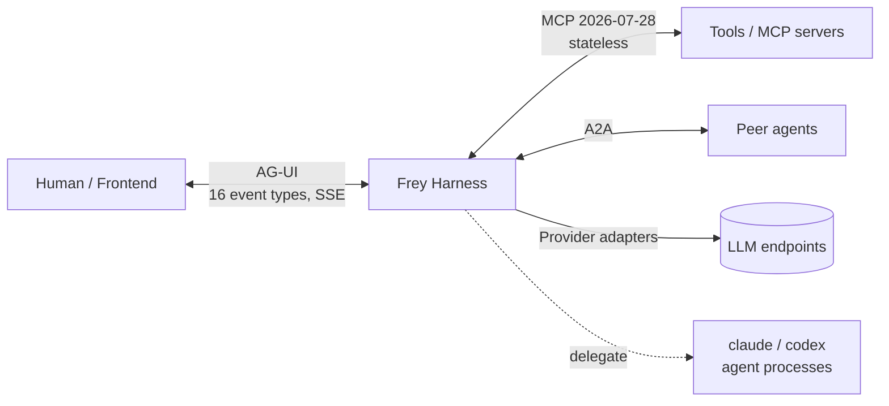

# Research 03 — Landscape & Wedge

*Gathered 2026-08-08. Purpose: find a reason to exist that survives an adversarial reading.*

---

## 1. The Rust field as it actually stands

| Project | Shape | Notable | Weak spot (as reported) |
|---|---|---|---|
| **Rig** (0xPlaygrounds) | LLM **library**, not a framework | v0.36.0, ~8.2k★; `rig-core` + `rig-agent`; 20+ providers, 10+ vector stores; transcription/audio/image; **wasm32 support**; used by St. Jude, Neon, Ryzome | README literally says *"Here be dragons… future updates will contain breaking changes."* Positioned by surveyors as **complementary to frameworks, not a framework** — no orchestration, no sandboxing, no MCP server story in the README |
| **AutoAgents** (liquidos-ai) | Actor-based multi-agent on **Ractor** | derive macros for tools/outputs, `BasicExecutor`/`ReActExecutor`, sliding-window memory, **WASM tool sandbox**, edge focus | Partial MCP; actor model forces message passing where shared read-only context is what agents actually want |
| **OpenFANG** (RightNow-AI) | "Agent **Operating System**" | ~17.6k★, open-sourced 2026-03-01, 14 crates / ~137k LoC, ~32 MB single binary, 38 built-in tools, 40 channel adapters, 16 "security systems", 7 autonomous "Hands", MCP **and** A2A, episodic/semantic/procedural memory, crypto audit chain, RBAC, `Zeroizing<String>` | It is an **OS/product**, not a library you compose into your app. Opinionated to the point of being a platform migration. Enormous surface to audit |
| **ADK-Rust** (Zavora) | Modular, 22 crates | 15+ providers, **MCP native**, realtime voice, RAG w/ 6 vector backends, **OTel built in** | "complexity of maintaining 22 crates; steep learning curve; documentation quality concerns" |
| **Kowalski**, **swarms-rs**, **GraphBit**, **rs-agent**, **agentai** | assorted | Kowalski = zero-Python standalone binaries; swarms-rs = enterprise/compliance; GraphBit = Rust core + Python bindings, DAG scheduling | GraphBit reintroduces the GIL at the wrapper; the small ones have no isolation, no MCP, <500★ |

Surveyors' verdict, near-verbatim: the ecosystem is **"crowded but immature at the framework
level, with infrastructure remaining the genuine opportunity area."** Named ecosystem gaps:

1. No standard **inter-agent message schema** — everyone invents one.
2. No pattern for **shared read-only context** across many concurrent agents (actors forbid it).
3. No convention for **streaming propagation through agent trees** (leaf tokens → root UI).
4. **Deterministic replay / testing** of async multi-agent runs is unsolved; nobody has it first-class.
5. **OTel span correlation across sub-agent boundaries** is not standardised.
6. **Durable execution** is user-implemented, not framework-native.
7. **Evaluation harnesses** sparse vs Python.
8. Long CPU-bound work still stalls the Tokio scheduler without explicit yields.

And the reference point on the Python side — **pydantic-ai** — is genuinely strong and is what
serious people compare against: typed deps + typed output, **toolsets as first-class composable
objects**, MCP, deferred/HITL tools, durable execution (Temporal/DBOS/Prefect), an event-stream
UI layer, and Pydantic Evals. Its toolset zoo is the state of the art in tool *plumbing*:

`FunctionToolset`, `CombinedToolset`, `FilteredToolset`, `PrefixedToolset`, `RenamedToolset`,
`PreparedToolset`, `ApprovalRequiredToolset`, **`DeferredLoadingToolset`**,
`IncludeReturnSchemasToolset`, `SetMetadataToolset`, `WrapperToolset`, `ExternalToolset`,
plus lifecycle hooks `for_run()` / `for_run_step()` and `get_instructions()`.

> Read that list again as a Rust programmer. It is **`tower::Layer` with the serial numbers filed
> off.** Every one of those is a middleware wrapping a `Service<ToolCall> -> ToolResult`.
> Python had to hand-roll twelve classes; Rust already has the abstraction, the ecosystem, and
> the zero-cost composition. This is not a small observation — it is the shape of Frey's tool layer.

---

## 2. Adversarial pass: is the wedge already occupied?

The candidate wedge from research 01 was: *"context as a scarce, cache-sensitive, ordered
resource; progressive disclosure as the central abstraction."* Let me try to kill it.

**Attack 1 — "Anthropic already ships tool search and PTC, so it's the provider's job."**
Partly true, and it *raises* the bar rather than removing the need: tool search is
Anthropic-only and server-side, still requires you to **transmit every definition every request**,
and caps at 5 results/search. OpenAI's Responses API has its own hosted tool search with different
semantics. OpenRouter's routed providers have neither. So a cross-provider agent needs a
**client-side discovery layer that delegates to the provider-native one when it exists and
emulates it when it doesn't**. Nobody has built that. → **Wedge survives, narrowed.**

**Attack 2 — "pydantic-ai has `DeferredLoadingToolset`, so it's solved."**
It solves *hiding*. It does not solve **cache-aware ordering** (which tools go in the stable
prefix vs. the churny suffix), per-model minimum-prefix arithmetic, or the interaction between
discovery and prompt-cache invalidation. And it is Python. → **Wedge survives.**

**Attack 3 — "OpenFANG has 38 tools, 16 security systems, MCP + A2A. It's done."**
OpenFANG's claim is *completeness as a platform*. Its cost is that you adopt an operating system.
There is no evidence it treats context budget or prompt-cache determinism as a first-class
subsystem, and "16 security systems" is a marketing count, not an auditable capability model.
Different product. → **Wedge survives, but Frey must not try to out-feature it.**

**Attack 4 — "Cloudflare Code Mode already did the token-efficiency thing."**
Cloudflare's implementation is bound to Workers/V8 isolates and their infrastructure. The *idea*
is public and unpatented; the *portable, self-hosted, Rust* implementation is not. → **Survives.**

**Attack 5 — "This is a feature, not a framework."**
The strongest attack. Answer: it is a *cross-cutting constraint*, like memory safety. You cannot
bolt cache-aware context budgeting onto a framework whose core type is `Vec<Message>` and whose
tool registry is a `HashMap<String, Box<dyn Tool>>` materialised at startup. It has to be in the
core types — which is exactly the argument for a new framework rather than a PR to Rig.

**Verdict: the wedge holds, stated precisely:**

> **Frey is the agent framework where the context window is a managed resource with a budget,
> a cache plan, and a provenance label — enforced by the type system — and where tools, skills,
> and code-mode are three views of one progressively-disclosed capability catalog.**

Two supporting pillars that are also unoccupied in Rust:

- **Security you can hand to an auditor.** A capability/permission model, a cross-platform
  sandbox, typed taint tracking, an append-only audit log, egress allowlists. (Research 04.)
- **Harness-grade ergonomics.** Deterministic replay, OTel across sub-agent boundaries,
  AG-UI event streaming, delegating to `claude`/`codex` as sub-agents. Every survey lists these
  as missing; none of them is hard in Rust; together they are what turns a framework into a
  harness toolkit.

---

## 3. The three-protocol reality of 2026

- **MCP** — agent↔tool. Covered in research 01.
- **A2A** — agent↔agent. OpenFANG ships it; it is table stakes for interop claims.
- **AG-UI** — agent↔frontend. Open, event-based, ~16 event types (up from 4), single ordered
  JSON event stream over HTTP (+ optional binary channel), shared state via **event-sourced diffs
  with conflict resolution**, frontend-executed tool calls with typed return paths, and
  **interrupts** (pause / approve / edit / retry / escalate mid-flow without losing state).
  Adopted by AWS Bedrock AgentCore Runtime (Mar 2026) and Microsoft Agent Framework.

AG-UI's *interrupt* semantics and MCP's *MRTR* `input_required` semantics are the same shape.
Frey should have **one** internal type for "the run needs something from outside before it can
continue" and project it onto both protocols. That single unification is worth a lot: it makes
human approval, MCP elicitation, frontend tool execution, and durable-execution suspension the
same code path.

---

## 4. What "meeting the developer where they stand" means concretely

Observed 2026 developer behaviours to design for:

1. They already have MCP servers. Frey must consume them in one line, including legacy ones.
2. They already pay for Claude Max / ChatGPT Pro. Frey must let them *delegate* to those agents
   (§ research 02 §4) without asking them to break ToS.
3. They are writing **harnesses**, not chatbots: a loop + tools + a UI + approvals + logs.
4. They expect OTel, not `println!`.
5. They expect the framework to be legible to **their coding agent**. That means: predictable
   module paths, one obvious way to do things, doc examples that compile (`#[doc = include_str!]`
   + doctests), error messages that tell an LLM what to do next, and a `frey.toml` whose schema
   is published as JSON Schema so an agent can author it correctly first try.

---

## Sources

- [Zylos: Rust-native AI agent frameworks ecosystem 2026](https://zylos.ai/research/2026-04-01-rust-native-ai-agent-frameworks-ecosystem-2026/) · [Zylos: Rust AI agent frameworks infrastructure](https://zylos.ai/en/research/2026-03-31-rust-ai-agent-frameworks-infrastructure/)
- [Wren: The Rust Agent Framework Landscape in 2026](https://wrenlearnsrust.com/posts/rust-agent-framework-landscape-2026.html) · [Wren: The Rust Agent Ecosystem in 2026](https://wrenlearnsrust.com/posts/rust-agent-ecosystem-2026.html)
- [Rig on GitHub](https://github.com/0xPlaygrounds/rig) · [OpenFang on GitHub](https://github.com/RightNow-AI/openfang) · [AutoAgents on crates.io](https://crates.io/crates/autoagents)
- [pydantic-ai toolsets](https://pydantic.dev/docs/ai/tools-toolsets/toolsets/) · [pydantic-ai overview](https://pydantic.dev/docs/ai/overview/)
- [AG-UI docs](https://docs.ag-ui.com/introduction) · [Zylos: agent-frontend streaming protocols](https://zylos.ai/research/2026-05-03-agent-frontend-streaming-protocols-ag-ui-convergence/)

---

## 5. Adversarial re-check, 2026-08-09 (before the README went public)

The notes committed to re-running §2 before making the claim in public. Doing so found two things,
and honesty about both is worth more than the original phrasing.

### Partial prior art exists, in a different shape

- **`make-agents-cheaper`** (Just-Agent) — a Rust CLI that *"fingerprints prompt layers, checks tool
  schema stability, analyzes cache breakpoints, records token usage, and compares baseline vs
  cache-friendly runs."* This is close to Frey's cache-planning claim, and it is Rust.
- **LeanCTX** — a local Rust binary described as a *"context intelligence layer"* that will
  *"relocate volatile fields out of the cacheable prefix so a stable system prompt finally caches"*,
  and pin reasoning effort across providers without breaking cache.

Both are **analysis and preprocessing tools that sit beside an agent**. Neither is a framework whose
core types carry a cache plan, and neither can refuse to place a breakpoint mid-run because neither
owns the loop. That distinction is real but it is narrower than "nobody has done this", so the
README says *"the cache planner refuses to waste your money"* and demonstrates it, rather than
claiming novelty. The right posture toward both is credit, not competition: they solve an adjacent
problem for people who do not want to change frameworks.

**Revised wedge statement:** Frey is not the first thing to notice that prompt caches break. It is
the first Rust *framework* where the cache plan is a core type, computed every turn from provider
capabilities, and where the loop will refuse a breakpoint the plan says is worthless.

### And it found a rule missing from our own planner

Anthropic search **up to 20 content blocks backward** from a breakpoint. A single agentic turn that
adds more than that — several tool calls and their results is enough — makes the *next* request miss
the cache entirely, with no error from anyone. The documented fix is an intermediate breakpoint
roughly every fifteen blocks.

This was recorded in research 02 §1 and then not implemented: the planner checked whether a segment
*changed*, never how far the distance to it had *grown*. Different failure, same silent symptom, and
exactly the class of thing Frey claims to catch.

Now implemented as `frey_context::cache::check_lookback`, wired into the loop, and tested. Finding
it is the whole argument for doing the adversarial pass rather than declaring victory: the exercise
that was supposed to defend a marketing claim improved the product instead.
