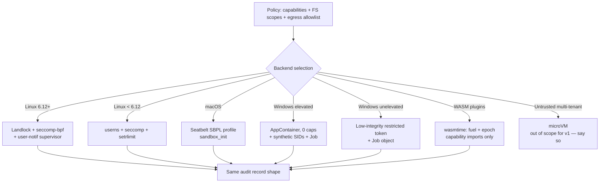

# Research 04 — Security & Sandboxing

*Gathered 2026-08-08. R10 says harnesses built on Frey should survive a security audit.
That means the security properties must be **structural and enumerable**, not vibes.*

---

## 1. The threat model (write this down before writing code)

An agent harness is a program that **takes instructions from untrusted text and executes them
with the developer's credentials on the developer's machine.** That is the whole problem.

Assets: source code, SSH keys, cloud credentials, customer data, the ability to write files,
the ability to make outbound network requests, the ability to spend money on tokens.

Adversaries, in rough order of likelihood:
1. **Indirect prompt injection** — a web page, a file, a tool result, an MCP server description,
   a `SKILL.md`, or a git commit message that contains instructions.
2. **Malicious/compromised MCP server or skill** — supply chain. Literature already exists:
   *"Under the Hood of SKILL.md: Semantic Supply-chain Attacks on AI Agent Skill Registry"*
   (arXiv 2605.11418).
3. **Model error** — no adversary needed; `rm -rf` because it misread a path.
4. **Compromised sub-agent** — in multi-agent chains, a subagent's output is untrusted input to
   its orchestrator, and the surface grows multiplicatively with depth.
5. **Credential exfiltration** through tool output, generated code, or logs.

Out of scope (be honest in the docs): kernel vulns, CPU side channels, a determined attacker with
local code execution outside the sandbox, and multi-tenant adversarial workloads — for which,
per the Sandlock authors, *"a microVM remains the right answer."*

---

## 2. The 2026 state of the art in injection defense

**Nothing solves it.** Anthropic's best adversarially-trained models sit around **~1% attack
success**, and the *"Attacker Moves Second"* work found human red-teamers hit **100% success
against all 12 evaluated published defenses** when optimizing per-system. So the honest question
is *"given that injection works, what reduces blast radius to acceptable levels?"*

Ranked by strength (deterministic first):

| Layer | Mechanism | Evidence |
|---|---|---|
| **1. Capability scoping** | Meta's **Agents Rule of Two**: within one session an agent may have at most **two** of {processes untrusted input, accesses private data, can change state / communicate externally}. If it needs all three: restart the session or require a human. | Meta AI, Nov 2025; descends from Chromium's rule of 2 and Willison's "lethal trifecta" |
| **2. Egress allowlisting** | All agent HTTP through a proxy that blocks unlisted domains. Kills most exfil regardless of injection success. | — |
| **3. Information-flow control** | **FIDES** (MSR): confidentiality + integrity labels propagate through every operation; policy engine deterministically forbids tool calls on low-integrity data and flows to unauthorised sinks. **Stopped all tested AgentDojo attacks and completed 16% *more* tasks than baseline.** | FIDES, May 2025 |
| **4. Dual-LLM / capability interpreter** | **CaMeL**: privileged LLM never sees untrusted content; quarantined LLM has no tools; custom interpreter tracks provenance and gates tool calls on capabilities. **77% AgentDojo completion vs 84% baseline** (7 pt utility cost) with provable guarantees. | CaMeL, Mar 2025 |
| **5. Structural isolation (spotlighting)** | Randomised delimiters, datamarking, or base64 so untrusted content is lexically distinct from instructions. | — |
| **6. Execution monitoring** | **MELON**: re-run with the user prompt masked; if tool calls are identical, the agent isn't following the user → injection. **0.32% ASR, 68.7% utility, ~2× API calls.** Blind to text-response attacks. | MELON, ICML 2025 |
| **7. Classifier screening** | LlamaFirewall, Prompt Shields: 1.75–7.5% residual ASR. Probabilistic; adaptive attacks defeat them. | — |
| **8. HITL gates** | Approval for high-risk ops — **displaying the actual low-level action (exact command string, exact HTTP request), never a natural-language summary.** | — |
| **9. Output hardening** | No auto-render of external images; strip Unicode Tag chars **U+E0000–U+E007F**; sanitise Markdown. | — |

Unsolved and worth stating in Frey's own docs: memory poisoning across sessions (write and read
phases separate in time), response-based exfiltration (monitors watch tool calls, not prose), and
multi-agent privilege escalation up an orchestrator chain.

> **The FIDES result is the design North Star.** Information-flow labels *improved* task success
> by 16%. Structure helps the model. In Rust, labels can be **types**, checked at compile time,
> with zero runtime cost. Python cannot do this — it can only check at runtime and hope nobody
> forgot a wrapper. **This is Frey's strongest single security claim, and it is genuinely novel
> in the Rust agent space.**

---

## 3. Sandboxing: what is actually achievable, per platform

### 3.1 Linux — unprivileged, fast, real

**Sandlock** (`sandlock-core` on crates.io; arXiv 2605.26298) is the reference design and it is
already Rust. Split enforcement:

- **Static — Landlock LSM** (Linux **6.12+**, ABI 6+): filesystem read/write scopes and path rules,
  **TCP port restrictions**, IPC boundaries (abstract sockets, signals). Kernel-enforced, no
  per-syscall cost.
- **Filter — seccomp-bpf**: unconditional syscall denials; routes the interesting ones to…
- **Dynamic — seccomp user notification**: a supervisor dequeues notifications and uses
  **`pidfd_getfd()`** for TOCTOU-safe on-behalf operations (socket create/bind), process/memory
  limits, **HTTP method/host/path inspection**, `execve` argv inspection, filesystem effect capture.
  The supervisor **freezes sibling threads and peer processes read from `/proc`** before reading
  argv, to defeat thread-aliasing races.

Measured on Ryzen 5 5500U / Linux 6.18: **~5 ms startup added (vs ~300 ms for Docker, 44× faster
end-to-end)**; Redis SET/GET within noise of bare metal (75.2k vs 75.5k rps); **p99 0.51 ms vs
0.49 ms bare metal (Docker showed 3× p99 overhead)**; ~35 µs added per supervised network
round-trip; ~1,900 forks/s.

Network detail worth copying: **concrete hostnames are resolved once at sandbox start**, which
eliminates DNS-rebinding; wildcard hostnames are *deliberately excluded*.

Honest limits: memory caps count address space requested via syscalls, not resident pages
(main-thread stack growth isn't counted); limits are enforced cooperatively via syscall
interception, not at allocation; **network effects cannot be rolled back** (filesystem effects can
be captured/COW'd) — buffering outbound HTTP is proposed as an extension.

Fallback for kernels < 6.12: user namespaces + seccomp + `setrlimit` (cf. `sandbox-rs`), plus
optional cgroup v2 limits when available.

### 3.2 macOS — Seatbelt, deprecated but load-bearing

- `sandbox_init()` / SBPL profiles — the same kernel MAC framework behind the App Sandbox.
  `sandbox-exec` is the CLI wrapper. **Apple has deprecated `sandbox-exec` but it remains
  functional and is what the major agent CLIs actually use** (Claude Code, Codex, Gemini CLI,
  OpenClaw all ship Seatbelt profiles).
- Key property: **once applied, the profile cannot be removed or relaxed for the process
  lifetime, and it is inherited by every child.** That is exactly the semantics we want.
- Risk to document: Apple could remove it. Track `apple/containerization` issue #737
  ("clarify `sandbox-exec` deprecation timeline and provide a replacement"). Frey's macOS backend
  must be swappable behind the same trait.

### 3.3 Windows — restricted tokens, AppContainer, job objects

OpenAI's Codex CLI has the best-documented approach and it is **written in Rust**
(`codex-windows-sandbox` in the codex repo — **note: not published on crates.io**, so Frey must
implement its own via the `windows` crate rather than depend on it):

- **Elevated mode**: AppContainer profile with **zero capabilities**, capability SID provisioning,
  ACL management, network lockdown.
- **Unelevated fallback**: **low-integrity restricted primary token**, works without admin.
- **Synthetic SIDs** — SIDs corresponding to no real principal, placed in ACLs and in the
  sandboxed process's restricted token, to force extra access-check conditions on the workspace.
- **Job object**: kill-on-close + active-process limit + optional memory cap. Child is spawned
  **suspended**, assigned to the job, then resumed.
- Process mitigation policies + handle allowlisting via `STARTUPINFOEX`.
- Codex additionally does **PowerShell AST safety analysis** before execution — a good idea worth
  generalising: *parse the command, don't regex it.*

### 3.4 Cross-cutting: WASM

`wasmtime` with **fuel metering + epoch interruption** (as AutoAgents/OpenFANG use) gives a
capability-safe, deterministic, platform-independent sandbox with no kernel dependency. Trade-off:
only for code you compile to WASM — useless for "run `cargo test`". So Frey needs **both**:
WASM for untrusted *plugin* code, OS sandboxes for untrusted *host* commands.



**Non-negotiable design rule:** every backend produces the **same** `SandboxReport`
(what was allowed, what was denied, what was written, what egress was attempted). A harness that
can't produce that report can't pass an audit. And when no backend is available, Frey must
**fail closed with a loud, specific error** — never silently degrade to running unsandboxed.
That single behaviour is the difference between a security feature and security theatre.

---

## 4. The "actually secure shell tool" (R5), concretely

What makes almost every framework's shell tool insecure:
- it interpolates model output into a shell string → quoting/injection bugs;
- it inherits the parent's full environment (every API key in `env`);
- it inherits cwd and has the whole filesystem;
- it has unrestricted network;
- "safety" is a regex denylist of `rm -rf` and friends, which is trivially bypassed
  (`r''m -rf`, `$(printf ...)`, base64 | sh).

Frey's shell tool must instead:

1. **Parse, don't pattern-match.** Take `argv: Vec<String>`, not a command string. If a shell is
   genuinely needed, parse with a real POSIX shell parser and reason over the AST
   (Codex's PowerShell AST analysis is the precedent). **Allowlist by AST shape, never by regex.**
2. **Run under a sandbox backend from §3, or refuse.**
3. **Explicit environment.** Empty by default; variables added by name from a policy.
   Secrets are never in the environment — they are **capability bindings** resolved by the
   supervisor (Cloudflare Code Mode's insight: the sandbox never holds a credential).
4. **Explicit FS scope**: read set, write set, COW overlay for the workdir so effects are
   reviewable and revertible.
5. **Explicit egress**: deny-all default, allowlist of hostnames resolved once at start.
6. **Resource limits**: wall clock, CPU, memory, PID count, output bytes — with truncation that
   tells the model *how much* was truncated and how to get more.
7. **Every invocation produces an audit record** and emits an OTel span.
8. **Output is `Untrusted<String>`** (see §5) — it is attacker-controlled by construction.

---

## 5. Taint / information-flow as Rust types

The FIDES result plus Rust's type system suggest a design no Python framework can match:

```rust
// sketch — see architecture notes for the real thing
pub struct Tainted<T, L: Label> { value: T, provenance: Provenance, _l: PhantomData<L> }

pub trait Label { const INTEGRITY: Integrity; const CONFIDENTIALITY: Confidentiality; }

// A sink that mutates the world or leaves the machine requires high integrity:
pub fn require_trusted<T>(x: Tainted<T, HighIntegrity>) -> T { x.value }
```

- Anything derived from a tool result, a fetched page, a file, an MCP server description, or a
  sub-agent's output is **low integrity** by construction.
- Declassification is an **explicit, logged, auditable call site** — usually a human approval or
  a validating parser (`Tainted<String, Low> -> Result<Url, _>` narrows *and* raises integrity
  because the parser is the trusted arbiter).
- The Rule of Two becomes a **compile-time-checkable session property**: a session that has
  observed low-integrity input and holds a confidential capability cannot be handed a
  state-changing egress capability without an explicit, recorded escalation.

This gives auditors something they almost never get from an agent codebase: **an enumerable list
of declassification points**, each with a file:line, each logged at runtime.

---

## 6. Supply chain & secrets hygiene (cheap, and auditors always ask)

- `cargo deny` (licenses, advisories, bans, sources) + `cargo vet` or `cargo audit` in CI.
- `#![forbid(unsafe_code)]` in every crate that can afford it; the sandbox crates that can't
  must isolate `unsafe` in a small, documented, separately reviewed module.
- Secrets: `zeroize`/`secrecy` for in-memory key material; `Debug`/`Display` impls that redact;
  a `Secret<T>` that cannot be serialised by accident. (OpenFANG's `Zeroizing<String>` is the
  minimum bar, and it's a good one to match publicly.)
- **Log redaction is a type-level property**, not a regex over the log line.
- Skills and MCP servers are **untrusted content**: pin by digest, verify signatures where
  available, and treat a server's `description` field as attacker-controlled text that must be
  labelled before it enters a prompt.
- Reproducible builds + SBOM (`cargo cyclonedx`) for the release binaries.

---

## Sources

- [Sandlock paper (arXiv 2605.26298)](https://arxiv.org/html/2605.26298) · [sandlock-core](https://crates.io/crates/sandlock-core) · [Multikernel: Processes Are All You Need for AI Sandboxing](https://multikernel.io/2026/03/14/introducing-sandlock/)
- [Landlock kernel docs](https://docs.kernel.org/userspace-api/landlock.html) · [rust-landlock](https://landlock.io/rust-landlock/landlock/) · [sandbox-rs](https://github.com/ErickJ3/sandbox-rs)
- [Codex CLI Windows sandbox deep dive](https://codex.danielvaughan.com/2026/07/18/codex-cli-windows-sandbox-architecture-powershell-ast-safety-elevated-unelevated-appcontainer-restricted-tokens/) · [Implementing an AppContainer (Microsoft)](https://learn.microsoft.com/en-us/windows/win32/secauthz/implementing-an-appcontainer)
- [macOS Seatbelt backend notes (microsoft/mxc)](https://github.com/microsoft/mxc/blob/main/docs/macos-support/seatbelt-backend.md) · [apple/containerization#737 — sandbox-exec deprecation](https://github.com/apple/containerization/issues/737) · [A deep dive on agent sandboxes](https://pierce.dev/notes/a-deep-dive-on-agent-sandboxes)
- [Meta: Agents Rule of Two](https://ai.meta.com/blog/practical-ai-agent-security/) · [Simon Willison on Rule of Two / Attacker Moves Second](https://simonwillison.net/2025/Nov/2/new-prompt-injection-papers/)
- [Zylos: Indirect prompt injection defenses 2026](https://zylos.ai/research/2026-04-12-indirect-prompt-injection-defenses-agents-untrusted-content/) · [arXiv 2605.11418 — SKILL.md supply-chain attacks](https://arxiv.org/pdf/2605.11418)
